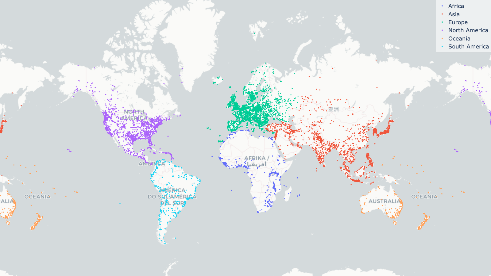
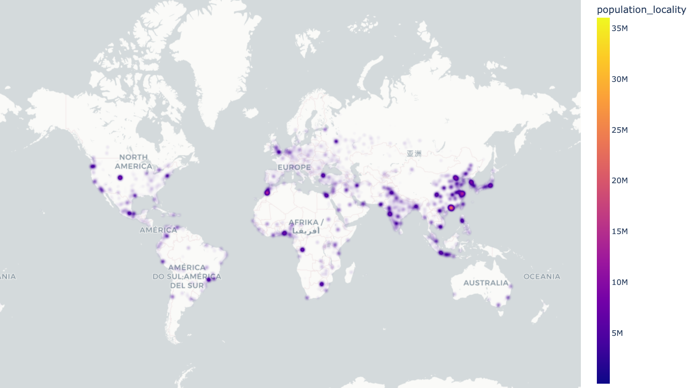
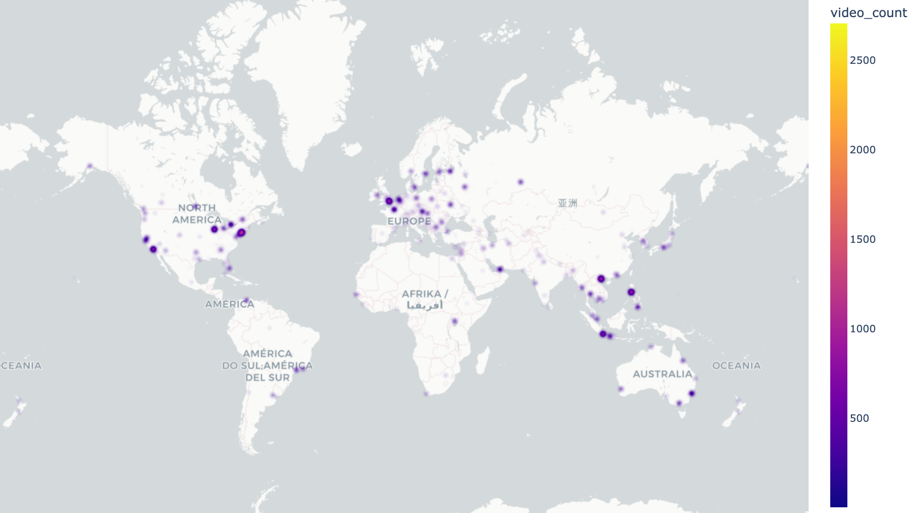
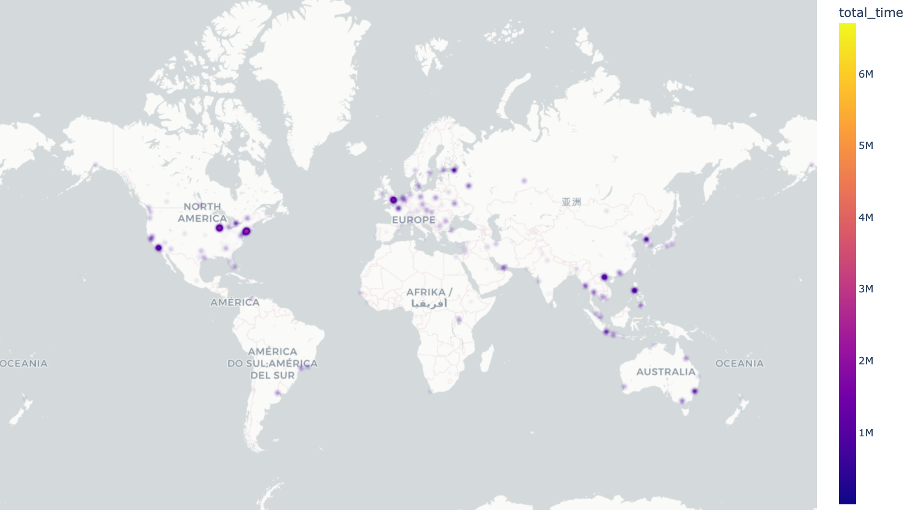
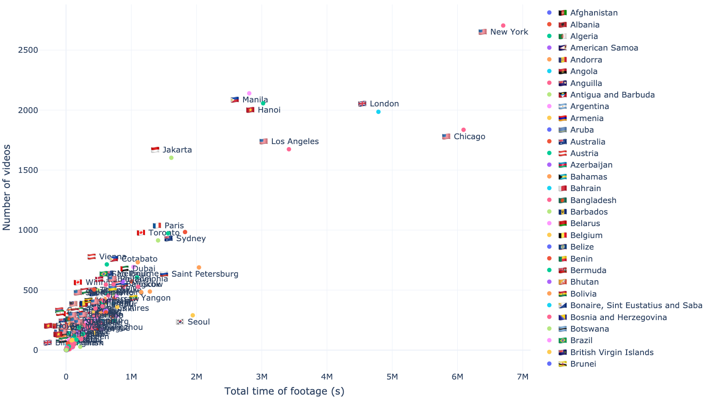
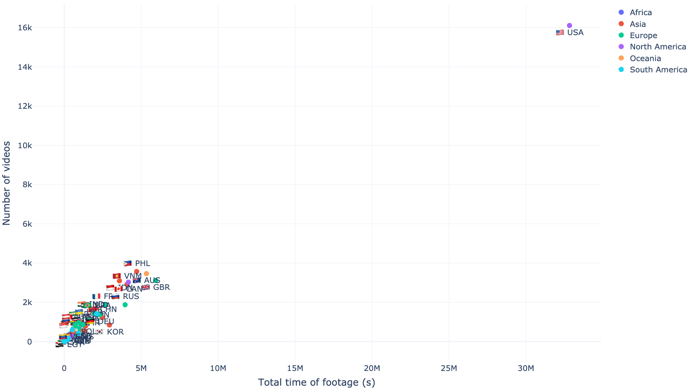
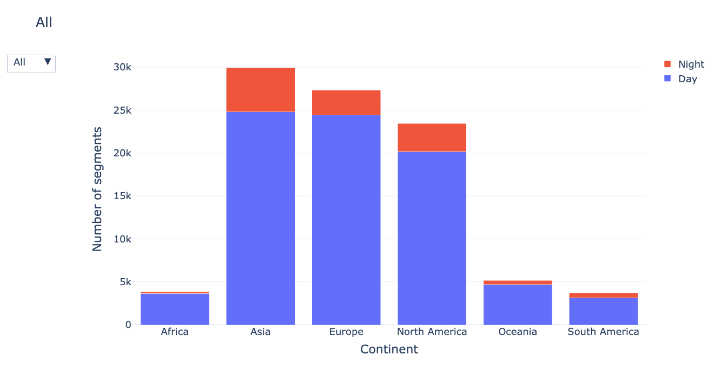
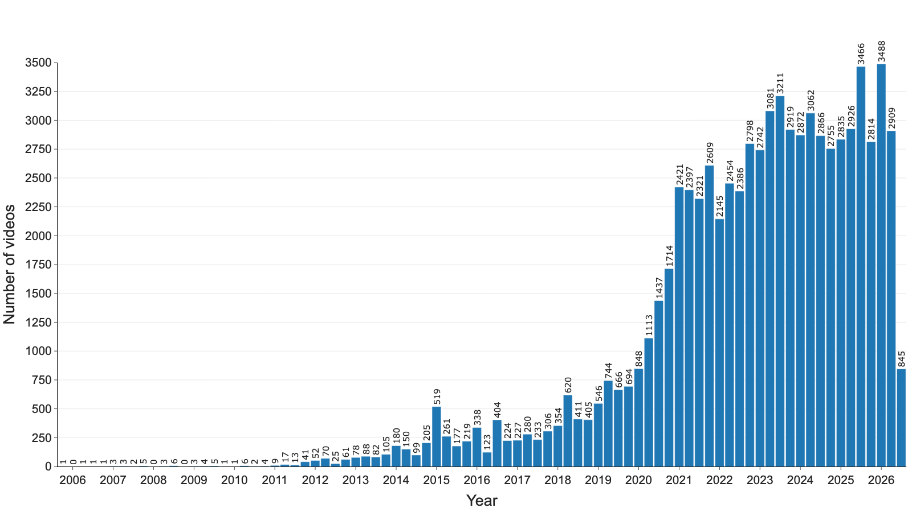
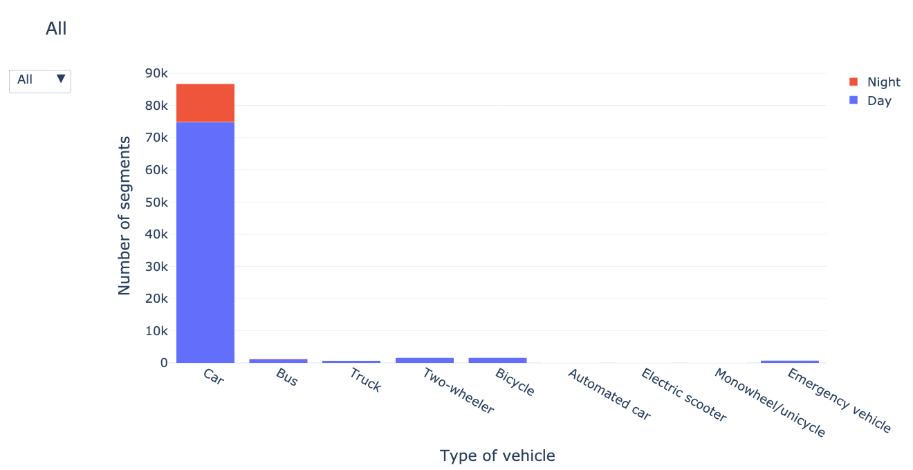

## City Road Observations With Dashcams (CROWD)
This repository contains code that extracts YouTube videos based on a `mapping.csv` file and performs object detection using YOLOv11. The primary objective of this work is to evaluate pedestrian behaviour in a cross-country or cross-cultural context using freely available YouTube videos.

This study presents a comprehensive cross-cultural evaluation of pedestrian behaviour during road crossings, examining variations between developed and developing states worldwide. As urban landscapes evolve and autonomous vehicles (AVs) become integral to future transportation, understanding pedestrian behaviour becomes paramount for ensuring safe interactions between humans and AVs. Through an extensive review of global pedestrian studies, we analyse key factors influencing crossing behaviour, such as cultural norms, socioeconomic factors, infrastructure development, and regulatory frameworks. Our findings reveal distinct patterns in pedestrian conduct across different regions. Developed states generally exhibit more structured and rule-oriented crossing behaviours, influenced by established traffic regulations and advanced infrastructure. In contrast, developing states often witness a higher degree of informal and adaptive behaviour due to limited infrastructure and diverse cultural influences. These insights underscore the necessity for AVs to adapt to diverse pedestrian behaviour on a global scale, emphasising the importance of incorporating cultural nuances into AV programming and decision-making algorithms. As the integration of AVs into urban environments accelerates, this research contributes valuable insights for enhancing the safety and efficiency of autonomous transportation systems. By recognising and accommodating diverse pedestrian behaviours, AVs can navigate complex and dynamic urban settings, ensuring a harmonious coexistence with human road users across the globe.

The dataset is available on [kaggle](https://www.kaggle.com/datasets/anonymousauthor123/pedestrian-in-youtubepyt). The dataset shall soon be made available on a permanent FAIR storage.

## Citation and usage of code
If you use this work for academic work please cite the following paper:

> Alam, M. S., Bazilinska, O., & Bazilinskyy, P. (2026). A global dataset of continuous urban dashcam driving. arXiv preprint arXiv:2604.01044. Under review. Available at https://arxiv.org/abs/2604.01044

The code is open-source and free to use. It is aimed for, but not limited to, academic research. We welcome forking of this repository, pull requests, and any contributions in the spirit of open science and open-source code. For inquiries about collaboration, you may contact Md Shadab Alam (md_shadab_alam@outlook.com) or Pavlo Bazilinskyy (pavlo.bazilinskyy@gmail.com).

## Getting started

Tested with **Python 3.12.13** and the [`uv`](https://docs.astral.sh/uv/) package manager.

The project is configured to automatically select the appropriate PyTorch backend. On systems with a supported NVIDIA GPU and CUDA driver, `uv` installs a CUDA enabled version of PyTorch. If no supported GPU is detected, it automatically falls back to the CPU version.

### Step 1: Install `uv`

`uv` is a fast Python package and environment manager.

**macOS / Linux:**

```bash
curl -LsSf https://astral.sh/uv/install.sh | sh
```

**Windows PowerShell:**

```powershell
irm https://astral.sh/uv/install.ps1 | iex
```

**Alternative, if Python and pip are already installed:**

```bash
pip install uv
```

### Step 2: Fix permissions if needed

In some environments, `uv` may need to create directories under:

**macOS / Linux:**

```text
~/.local/share/uv/python
```

**Windows:**

```text
%LOCALAPPDATA%\uv\python
```

If these directories were previously created by another user or with elevated privileges, you may encounter an error such as:

```text
error: failed to create directory ... Permission denied (os error 13)
```

#### macOS / Linux

```bash
mkdir -p ~/.local/share/uv
chown -R "$(id -un)":"$(id -gn)" ~/.local/share/uv
chmod -R u+rwX ~/.local/share/uv
```

#### Windows PowerShell

```powershell
New-Item -ItemType Directory -Force "$env:LOCALAPPDATA\uv"

icacls "$env:LOCALAPPDATA\uv" /grant "$($env:UserName):(OI)(CI)F"
```

### Step 3: Verify `uv`

Check that `uv` is available:

```bash
uv --version
```

### Step 4: Clone the repository

```bash
git clone https://github.com/crowd-dataset/crowd.git
cd crowd
```

### Step 5: Install Python 3.12.13

The project is tested with **Python 3.12.13**.

Install it using `uv`:

```bash
uv python install 3.12.13
```

The repository contains a `.python-version` file so that `uv` can automatically select the correct Python version.

### Step 6: Create the virtual environment

Create a virtual environment in `.venv` using Python 3.12.13:

```bash
uv venv --python 3.12.13
```

### Step 7: Activate the virtual environment

**macOS / Linux:**

```bash
source .venv/bin/activate
```

**Windows PowerShell:**

```powershell
.\.venv\Scripts\Activate.ps1
```

**Windows Command Prompt:**

```bat
.\.venv\Scripts\activate.bat
```

### Step 8: Install the dependencies

Install the project dependencies from `pyproject.toml`:

```bash
uv pip install -r pyproject.toml
```

The project uses:

```toml
[tool.uv.pip]
torch-backend = "auto"
```

This allows `uv` to automatically select the appropriate PyTorch backend for the current machine.

For example:

* NVIDIA GPU with a compatible CUDA driver → CUDA enabled PyTorch
* No supported GPU → CPU PyTorch

No manual selection of a CUDA version should normally be required.

> **Note:** Do not use `uv sync` for the initial installation if automatic PyTorch backend detection is required. Automatic `torch-backend` selection currently applies to the `uv pip` interface.

### Step 9: Verify the PyTorch backend

Check which PyTorch backend was installed:

```bash
python -c "import torch; print('PyTorch:', torch.__version__); print('CUDA available:', torch.cuda.is_available()); print('CUDA version:', torch.version.cuda); print('Device:', torch.cuda.get_device_name(0) if torch.cuda.is_available() else 'CPU')"
```

On an NVIDIA CUDA system, the output should look similar to:

```text
PyTorch: 2.8.0+cu129
CUDA available: True
CUDA version: 12.9
Device: NVIDIA GeForce RTX 5090
```

On a machine without a supported GPU, `CUDA available` will be `False` and the CPU version of PyTorch will be used.

### Step 10: Add the datasets

Place the required datasets, including `mapping.csv`, in the `data/` directory.

The expected structure is:

```text
crowd/
├── data/
│   ├── mapping.csv
│   └── ...
├── analysis.py
├── pyproject.toml
└── ...
```

### Step 11: Run the analysis

Run:

```bash
python analysis.py
```


### Configuration of project
Configuration of the project needs to be defined in `config`. Please use the `default.config` file for the required structure of the file. If no custom config file is provided, `default.config` is used. The config file has the following parameters:
- **`data`**: Directory containing data (CSV output from YOLO).
- **`videos`**: Directories containing the videos used to generate the data.
- **`mapping`**: CSV file that contains mapping data for the cities referenced in the data.
- **`prediction_mode`**: Configures YOLO for object detection.
- **`tracking_mode`**: Configures YOLO for object tracking.
- **`always_analyse`**: Always conduct analysis even when pickle files are present (good for testing).
- **`display_frame_tracking`**: Displays the frame tracking during analysis.
- **`save_annotated_img`**: Saves the annotated frames produced by YOLO.
- **`delete_labels`**: Deletes label files from YOLO output.
- **`delete_frames`**: Deletes frames from YOLO output.
- **`delete_youtube_video`**: Deletes saved YouTube videos.
- **`compress_youtube_video`**: Compresses YouTube videos (using the H.255 codec by default).
- **`delete_runs_files`**: Deletes files containing YOLO output after analysis.
- **`check_missing_mapping`**: Identifies all the missing csv files.
- **`min_max_videos`**: Gives snippets of the fastest and slowest crossing pedestrian.
- **`track_buffer_sec`**: Keep tracks longer (in seconds).
- **`analysis_level`**: Specifies the analysis level; supported versions include `city` and `country`.
- **`client`**: Specifies the client type for downloading YouTube videos; accepted values are `"WEB"`, `"ANDROID"` or `"ios"`.
- **`model`**: Specifies the YOLO model to use; supported/tested versions include `v8x` and `v11x`.
- **`population_threshold`**: Specifies the minimum population a city must have to be included in the analysis.
- **`footage_threshold`**: Specifies the minimum amount of footage required for a city to be included in the analysis.
- **`min_city_population_percentage`**: Specifies the minimum proportion of a country’s population that a city must have to be included in the analysis.
- **`countries_analyse`**: Lists the countries to be analysed.
- **`confidence`**: Sets the confidence threshold parameter for YOLO.
- **`update_ISO_code`**: Updates the ISO code of the country in the mapping file during analysis.
- **`update_pop_country`**: Updates the country’s population in the mapping file during analysis.
- **`update_gini_value`**: Updates the GINI value of the country in the mapping file during analysis.
- **`update_pytubefix`**: Updates the `pytubefix` library each time analysis starts.
- **`font_family`**: Specifies the font family to be used in outputs.
- **`font_size`**: Specifies the font size to be used in outputs.
- **`plotly_template`**: Defines the template for Plotly figures.
- **`logger_level`**: Level of console output. Can be: debug, info, warning, error.
- **`sleep_sec`**: Amount of seconds of pause in the end of the loop in `main.py`.
- **`git_pull`**: Pull changes from git repository in the end of the loop in `main.py`.
- **`email_send`**: Send email about completion of the job in the end of the loop in `main.py`. See the following paragraph for the additional parameters in the `secret` file.
- **`email_sender`**: Email address of the the "sender" of the email.
- **`email_recipients`**: List of emails for sending the message.
- **`max_workers`**: Specifies the maximum number of segment-processing worker threads (i.e., how many segments can be analysed in parallel). Increasing this increases concurrent segment processing, subject to GPU/CPU and I/O limits.
- **`download_workers`**: Specifies the maximum number of concurrent video download/prepare workers. Increasing this allows multiple videos to be downloaded/prepared in parallel (useful when network/FTP is the bottleneck).
- **`max_active_segments_per_video`**: Specifies the maximum number of segments from the *same video* that are allowed to be processed concurrently.
  - If set to **1**, the scheduler tends to distribute workers across **different videos** (e.g., with `max_workers=3`, it will try to process 3 different videos at once).
  - If set to **2+**, multiple workers may process segments from the **same video** simultaneously, which can improve throughput when one video has many segments but reduces “video diversity” across workers.


For working with external APIs of [VideoFiles](https://files.mobility-squad.com/), [GeoNames](https://www.geonames.org), [BEA](https://apps.bea.gov/api/signup), [TomTom](https://developer.tomtom.com/user/register), [Trafikab](https://www.trafiklab.se/api/trafiklab-apis), and [Numbeo](https://www.numbeo.com/common/api.jsp) (paid), the API keys need to be placed in file `secret` (no extension) in the root of the project. The file needs to be formatted as `default.secret`. The email SMTP server, account and password need to be also set here. This is optional for just running the analysis on the dataset. For running the the `main.py` script at least an empty `secret` file directly copies from the template is required.

## Example of YOLO output for a video with dashcam footage

<a href="https://youtu.be/NipvoDg0Nyk">
  
</a>

Video: [https://www.youtube.com/watch?v=_Wyg213IZDI](https://www.youtube.com/watch?v=_Wyg213IZDI).

## Selection procedure

### Segments of videos were not selected if frames are skipped
<a href="https://youtu.be/0K9vaQxKZ9k">
  
</a>

Video: [https://www.youtube.com/watch?v=0K9vaQxKZ9k](https://www.youtube.com/watch?v=0K9vaQxKZ9k).

### Snippets of videos are not analysed during the movement of camera
<a href="https://youtu.be/3jVszt_78_k">
  
</a>

Video: [https://www.youtube.com/watch?v=3jVszt_78_k](https://www.youtube.com/watch?v=3jVszt_78_k).

### Videos are excluded from analysis if the camera is unstable or shaking
<a href="https://youtu.be/uFG1_JBZUmM">
  
</a>

Video: [https://www.youtube.com/watch?v=uFG1_JBZUmM](https://www.youtube.com/watch?v=uFG1_JBZUmM).

### Snippets of videos captured in parking areas were excluded from analysis
<a href="https://youtu.be/U0pdQ8eZtHY">
  
</a>

Video: [https://www.youtube.com/watch?v=U0pdQ8eZtHY](https://www.youtube.com/watch?v=U0pdQ8eZtHY).

### Videos are excluded from analysis if another video is a part of main video
<a href="https://youtu.be/rdx7UFXYSz0">
  
</a>

Video: [https://www.youtube.com/watch?v=rdx7UFXYSz0](https://www.youtube.com/watch?v=rdx7UFXYSz0).

## Description and analysis of dataset
> **Note:** The interactive figures are displayed using `htmlpreview.github.io`, which may be blocked on some institutional or education networks. If an interactive figure does not open, try another network or download the corresponding `.html` file from the `figures` directory and open it locally in a web browser.

### Description of dataset


[](https://htmlpreview.github.io/?https://github.com/crowd-dataset/crowd/blob/main/figures/mapbox_map_all.html)
Locations of cities with footage in dataset. *Note:* continents are based on geography, i.e., the cities in Russia east from Ural mountains are shown as Asia.

[](https://htmlpreview.github.io/?https://github.com/crowd-dataset/crowd/blob/main/figures/mapbox_map_all_pop.html)
Locations of cities with footage in dataset with a density overlay of population. *Note:* continents are based on geography, i.e., the cities in Russia east from Ural mountains are shown as Asia.

[](https://htmlpreview.github.io/?https://github.com/crowd-dataset/crowd/blob/main/figures/mapbox_map_all_videos.html)
Locations of cities with footage in dataset with a density overlay of the number of videos in the dataset. *Note:* continents are based on geography, i.e., the cities in Russia east from Ural mountains are shown as Asia.

[](https://htmlpreview.github.io/?https://github.com/crowd-dataset/crowd/blob/main/figures/mapbox_map_all_time.html)
Locations of cities with footage in dataset with a density overlay of the total number of seconds of footage in the dataset. *Note:* continents are based on geography, i.e., the cities in Russia east from Ural mountains are shown as Asia.

[](https://htmlpreview.github.io/?https://github.com/crowd-dataset/crowd/blob/main/figures/scatter_all_total_time-video_count.html)
Total time of footage over the number of videos in the dataset on the city level. *Note:* continents are based on geography, i.e., the cities in Russia east from Ural mountains are shown as Asia.

[](https://htmlpreview.github.io/?https://github.com/crowd-dataset/crowd/blob/main/figures/scatter_all_country_total_time-video_count.html)
Total time of footage over the number of videos in the dataset on the country level. *Note:* continents are based on geography, i.e., the cities in Russia east from Ural mountains are shown as Asia.

[](https://htmlpreview.github.io/?https://github.com/crowd-dataset/crowd/blob/main/figures/bar_continent_time_of_day.html)
Distribution of videos by continent. *Note:* continents are based on geography, i.e., the cities in Russia east from Ural mountains are shown as Asia.

[](https://htmlpreview.github.io/?https://github.com/crowd-dataset/crowd/blob/main/figures/hist_months.html)
Time of upload of videos.

[](https://htmlpreview.github.io/?https://github.com/crowd-dataset/crowd/blob/main/figures/bar_vehicle_type_time_of_day.html)
Distribution of segments (parts of videos included in dataset) by type of vehicle.


## Adding videos to dataset
To add more videos to the the `mapping` file, run `python add_video.py`. It is a Flask web form which allows to add new footage. The form understands if the city is already present in the dataset and adds a new videos to the existing row in the mapping file. Providing state is optional, and is recommended for USA 🇺🇸 and Canada 🇨🇦. Providing country is mandatory.


Adding new video to a city. In the case for Delft, Netherlands 🇳🇱 (with state not mentioned).

For each video, it is possible to add multiple segments (parts of the video). To add a new segment/video, it is mandatory to add the following information: `Time of day`, `Vehicle`, `Start time (seconds)` (a counter of the current second is shown under the embedded video), `End time (seconds)` (it must be larger than the starting time), and `FPS` (to see the FPS of the video, click with secondary mouse button on the video and go to "Stats for nerds"🤓; FPS value is shown as a value following the resolution, e.g. "1920x1080@30"). All other values are attempted to be fetched automatically from various APIs and by analysing the video. All values can be adjusted by hand in the `mapping` file in case of mistakes/missing information.

Each video can contain multiple segments (with each new segment starting at the same timestamp as the end of the previous segment or later). All video-level values (including FPS) do not have to be updated for each new segment (i.e., only start and end, time of day, and vehicle type of each new segment shall be provided).


Form understands that there is no entry for Delft, Netherlands in the mapping file yet and allows to add the first video for that city. The latitude and longitude coordinates are fetched for new cities automatically. They are shown on the embed map under the video. Dragging the marker will adjusted the fetched coordinates.


If the city already exists in data, the form extends the entry for that city with the new video. In this example, a new video is added to Kyiv, Ukraine 💙💛. The values in `Start time` and `End time` under the embedded video also indicate that one or multiple segments for this video are already present in the `mapping` file; in this case a new segment would be added to the video.

## Shortcuts and click events
The form accepts the following shortcuts and click events:
1. **A**: pasting current timestamp in video to the "Start time (seconds)" field.
2. **S**: pasting current timestamp in video to the "End time (seconds)" field.
3. **D**: pasting the value of "Last second" (red value under embedded video) to the "End time (seconds)" field and setting "Start time (seconds)" field as 0. Clicking on "Current time" results in the same behaviour.
4. **Q**: selecting "Day" value for "Time of day" field.
5. **W**: selecting "Night" value for "Time of day" field.

## Contact
If you have any questions or suggestions, feel free to reach out to md_shadab_alam@outlook.com or pavlo.bazilinskyy@gmail.com.

## Licence

**Code:** MIT License  
**CROWD dataset:** Creative Commons Attribution 4.0 International (CC BY 4.0)

The dataset licence covers CROWD generated structured data, annotations,
and derived computer vision outputs. It does not cover the underlying
YouTube videos or other third party content.

CROWD does not redistribute the original YouTube videos, extracted frames,
or images. Source videos remain subject to the rights of their respective
owners and YouTube's Terms of Service.
