## City Road Observations With Dashcams (CROWD)
This repository contains code that extracts YouTube videos based on a `mapping.csv` file and performs object detection using YOLOv11. The primary objective of this work is to evaluate pedestrian behaviour in a cross-country or cross-cultural context using freely available YouTube videos.

This study presents a comprehensive cross-cultural evaluation of pedestrian behaviour during road crossings, examining variations between developed and developing states worldwide. As urban landscapes evolve and autonomous vehicles (AVs) become integral to future transportation, understanding pedestrian behaviour becomes paramount for ensuring safe interactions between humans and AVs. Through an extensive review of global pedestrian studies, we analyse key factors influencing crossing behaviour, such as cultural norms, socioeconomic factors, infrastructure development, and regulatory frameworks. Our findings reveal distinct patterns in pedestrian conduct across different regions. Developed states generally exhibit more structured and rule-oriented crossing behaviours, influenced by established traffic regulations and advanced infrastructure. In contrast, developing states often witness a higher degree of informal and adaptive behaviour due to limited infrastructure and diverse cultural influences. These insights underscore the necessity for AVs to adapt to diverse pedestrian behaviour on a global scale, emphasising the importance of incorporating cultural nuances into AV programming and decision-making algorithms. As the integration of AVs into urban environments accelerates, this research contributes valuable insights for enhancing the safety and efficiency of autonomous transportation systems. By recognising and accommodating diverse pedestrian behaviours, AVs can navigate complex and dynamic urban settings, ensuring a harmonious coexistence with human road users across the globe.

The dataset is available on [kaggle](https://www.kaggle.com/datasets/anonymousauthor123/pedestrian-in-youtubepyt). The dataset shall soon be made available on a permanent FAIR storage.

<!-- dataset-stats:start -->
<!-- Generated by analysis.py, do not edit by hand. -->
## Dataset overview
- **Footage:** 34,206.5 hours (1,425.3 days)
- **Videos:** 76,320 unique videos split into 97,750 segments
- **Localities (cities):** 9,988
- **Countries and territories:** 238
- **Continents:** 6
- **Last updated:** 2026-10-09 18:16 UTC

<details><summary><b>All 238 countries and territories</b></summary>

| # | Country | Cities | Videos | Footage (h) |
|---|---|---|---|---|
| 1 | 🇺🇸 United States | 2,178 | 18,492 | 9,651.9 |
| 2 | 🇬🇧 United Kingdom | 358 | 3,152 | 1,669.5 |
| 3 | 🇦🇺 Australia | 204 | 3,856 | 1,620.0 |
| 4 | 🇷🇺 Russia | 205 | 3,082 | 1,449.6 |
| 5 | 🇵🇭 Philippines | 398 | 3,570 | 1,308.3 |
| 6 | 🇨🇦 Canada | 223 | 3,032 | 1,166.5 |
| 7 | 🇻🇳 Vietnam | 68 | 2,918 | 1,134.6 |
| 8 | 🇮🇩 Indonesia | 176 | 3,095 | 997.2 |
| 9 | 🇰🇷 South Korea | 84 | 847 | 816.4 |
| 10 | 🇫🇷 France | 359 | 1,890 | 744.6 |
| 11 | 🇨🇳 China | 148 | 1,227 | 692.2 |
| 12 | 🇩🇪 Germany | 235 | 1,368 | 648.6 |
| 13 | 🇧🇷 Brazil | 129 | 1,415 | 590.4 |
| 14 | 🇯🇵 Japan | 219 | 1,697 | 584.6 |
| 15 | 🇳🇱 Netherlands | 231 | 1,442 | 547.2 |
| 16 | 🇮🇳 India | 294 | 1,495 | 478.6 |
| 17 | 🇺🇦 Ukraine | 94 | 1,083 | 443.1 |
| 18 | 🇹🇭 Thailand | 49 | 790 | 385.1 |
| 19 | 🇲🇲 Myanmar | 19 | 536 | 371.5 |
| 20 | 🇦🇪 United Arab Emirates | 10 | 862 | 357.3 |
| 21 | 🇵🇱 Poland | 280 | 859 | 338.0 |
| 22 | 🇮🇷 Iran | 108 | 980 | 317.3 |
| 23 | 🇲🇾 Malaysia | 65 | 593 | 280.3 |
| 24 | 🇹🇷 Türkiye | 87 | 565 | 268.6 |
| 25 | 🇸🇪 Sweden | 167 | 961 | 266.5 |
| 26 | 🇮🇹 Italy | 168 | 670 | 261.4 |
| 27 | 🇦🇷 Argentina | 64 | 410 | 255.9 |
| 28 | 🇩🇰 Denmark | 22 | 562 | 255.2 |
| 29 | 🇷🇴 Romania | 91 | 633 | 242.6 |
| 30 | 🇫🇮 Finland | 41 | 382 | 238.9 |
| 31 | 🇪🇸 Spain | 251 | 650 | 227.6 |
| 32 | 🇰🇭 Cambodia | 7 | 427 | 222.6 |
| 33 | 🇨🇿 Czechia | 82 | 374 | 214.6 |
| 34 | 🇦🇹 Austria | 45 | 849 | 202.5 |
| 35 | 🇺🇬 Uganda | 19 | 516 | 193.1 |
| 36 | 🇭🇺 Hungary | 34 | 469 | 171.8 |
| 37 | 🇵🇰 Pakistan | 38 | 415 | 163.5 |
| 38 | 🇧🇬 Bulgaria | 89 | 643 | 162.6 |
| 39 | 🇳🇿 New Zealand | 160 | 595 | 159.5 |
| 40 | 🇸🇬 Singapore | 1 | 399 | 155.2 |
| 41 | 🇻🇪 Venezuela | 15 | 599 | 148.2 |
| 42 | 🇲🇽 Mexico | 72 | 306 | 144.2 |
| 43 | 🇮🇪 Ireland | 55 | 491 | 142.4 |
| 44 | 🇧🇾 Belarus | 83 | 281 | 139.3 |
| 45 | 🇳🇴 Norway | 68 | 421 | 139.3 |
| 46 | 🇿🇦 South Africa | 55 | 448 | 134.0 |
| 47 | 🇸🇾 Syria | 13 | 316 | 124.7 |
| 48 | 🇪🇬 Egypt | 20 | 270 | 107.5 |
| 49 | 🇧🇩 Bangladesh | 29 | 298 | 107.3 |
| 50 | 🇵🇹 Portugal | 73 | 226 | 104.4 |
| 51 | 🇨🇭 Switzerland | 94 | 299 | 98.7 |
| 52 | 🇬🇲 Gambia | 29 | 361 | 95.4 |
| 53 | 🇳🇬 Nigeria | 35 | 229 | 91.7 |
| 54 | 🇸🇱 Sierra Leone | 46 | 183 | 79.1 |
| 55 | 🇯🇴 Jordan | 13 | 250 | 78.3 |
| 56 | 🇭🇷 Croatia | 89 | 281 | 71.9 |
| 57 | 🇨🇱 Chile | 43 | 160 | 71.9 |
| 58 | 🇲🇳 Mongolia | 4 | 130 | 71.4 |
| 59 | 🇬🇷 Greece | 40 | 196 | 66.9 |
| 60 | 🇨🇾 Cyprus | 17 | 252 | 66.5 |
| 61 | 🇪🇪 Estonia | 6 | 302 | 65.3 |
| 62 | 🇧🇪 Belgium | 61 | 190 | 62.9 |
| 63 | 🇧🇦 Bosnia and Herzegovina | 60 | 291 | 62.0 |
| 64 | 🇭🇰 Hong Kong | 11 | 161 | 60.9 |
| 65 | 🇨🇴 Colombia | 36 | 128 | 60.1 |
| 66 | 🇺🇿 Uzbekistan | 12 | 178 | 53.7 |
| 67 | 🇵🇪 Peru | 29 | 94 | 53.1 |
| 68 | 🇱🇰 Sri Lanka | 15 | 127 | 47.6 |
| 69 | 🇲🇦 Morocco | 35 | 135 | 47.6 |
| 70 | 🇷🇸 Serbia | 34 | 143 | 47.1 |
| 71 | 🇹🇼 Taiwan | 13 | 100 | 45.9 |
| 72 | 🇦🇿 Azerbaijan | 8 | 112 | 45.5 |
| 73 | 🇶🇦 Qatar | 5 | 98 | 44.3 |
| 74 | 🇸🇦 Saudi Arabia | 11 | 110 | 43.6 |
| 75 | 🇪🇹 Ethiopia | 8 | 76 | 43.2 |
| 76 | 🇬🇪 Georgia | 11 | 117 | 42.4 |
| 77 | 🇳🇵 Nepal | 4 | 120 | 38.2 |
| 78 | 🇱🇻 Latvia | 20 | 123 | 38.0 |
| 79 | 🇱🇧 Lebanon | 60 | 154 | 35.2 |
| 80 | 🇨🇺 Cuba | 25 | 168 | 34.6 |
| 81 | 🇱🇹 Lithuania | 10 | 84 | 33.5 |
| 82 | 🇰🇿 Kazakhstan | 26 | 113 | 30.9 |
| 83 | 🇲🇼 Malawi | 48 | 104 | 29.9 |
| 84 | 🇵🇷 Puerto Rico | 56 | 139 | 29.5 |
| 85 | 🇰🇪 Kenya | 55 | 110 | 26.3 |
| 86 | 🇺🇾 Uruguay | 23 | 90 | 25.3 |
| 87 | 🇲🇰 North Macedonia | 21 | 72 | 24.4 |
| 88 | 🇲🇩 Moldova | 14 | 107 | 24.2 |
| 89 | 🇦🇲 Armenia | 10 | 77 | 23.9 |
| 90 | 🇱🇦 Laos | 10 | 60 | 22.9 |
| 91 | 🇪🇨 Ecuador | 15 | 55 | 22.8 |
| 92 | 🇧🇴 Bolivia | 20 | 55 | 21.5 |
| 93 | 🇲🇨 Monaco | 1 | 44 | 19.5 |
| 94 | 🇮🇱 Israel | 18 | 67 | 19.5 |
| 95 | 🇽🇰 Kosovo | 31 | 93 | 15.4 |
| 96 | 🇬🇹 Guatemala | 9 | 23 | 15.3 |
| 97 | 🇦🇱 Albania | 23 | 62 | 14.8 |
| 98 | 🇩🇿 Algeria | 8 | 35 | 14.5 |
| 99 | 🇱🇾 Libya | 3 | 39 | 13.2 |
| 100 | 🇮🇸 Iceland | 14 | 39 | 12.8 |
| 101 | 🇹🇲 Turkmenistan | 1 | 85 | 12.0 |
| 102 | 🇨🇬 Congo (Congo-Brazzaville) | 3 | 30 | 11.8 |
| 103 | 🇬🇭 Ghana | 10 | 39 | 11.4 |
| 104 | 🇮🇶 Iraq | 10 | 40 | 11.4 |
| 105 | 🇴🇲 Oman | 10 | 32 | 10.9 |
| 106 | 🇸🇻 El Salvador | 6 | 13 | 10.8 |
| 107 | 🇭🇳 Honduras | 8 | 23 | 10.3 |
| 108 | 🇲🇪 Montenegro | 22 | 65 | 10.2 |
| 109 | 🇵🇦 Panama | 7 | 22 | 9.4 |
| 110 | 🇹🇿 Tanzania | 14 | 50 | 9.1 |
| 111 | 🇬🇾 Guyana | 6 | 20 | 9.0 |
| 112 | 🇧🇭 Bahrain | 11 | 42 | 8.8 |
| 113 | 🇸🇮 Slovenia | 25 | 47 | 8.5 |
| 114 | 🇰🇬 Kyrgyzstan | 7 | 40 | 8.4 |
| 115 | 🇯🇲 Jamaica | 10 | 30 | 8.3 |
| 116 | 🇵🇸 Palestine | 10 | 31 | 8.3 |
| 117 | 🇬🇮 Gibraltar | 1 | 21 | 7.9 |
| 118 | 🇲🇹 Malta | 31 | 56 | 7.6 |
| 119 | 🇨🇮 Côte d'Ivoire | 2 | 19 | 7.6 |
| 120 | 🇸🇰 Slovakia | 13 | 26 | 7.4 |
| 121 | 🇱🇺 Luxembourg | 12 | 24 | 7.0 |
| 122 | 🇰🇼 Kuwait | 2 | 21 | 6.9 |
| 123 | 🇱🇷 Liberia | 11 | 43 | 6.8 |
| 124 | 🇸🇷 Suriname | 3 | 19 | 6.7 |
| 125 | 🇿🇼 Zimbabwe | 4 | 26 | 6.3 |
| 126 | 🇬🇳 Guinea | 6 | 26 | 6.3 |
| 127 | 🇦🇬 Antigua and Barbuda | 9 | 21 | 6.1 |
| 128 | 🇵🇾 Paraguay | 8 | 18 | 5.9 |
| 129 | 🇻🇨 Saint Vincent and the Grenadines | 11 | 25 | 5.7 |
| 130 | 🇧🇯 Benin | 10 | 16 | 5.6 |
| 131 | 🇨🇫 Central African Republic | 3 | 18 | 5.4 |
| 132 | 🇦🇫 Afghanistan | 8 | 26 | 5.3 |
| 133 | 🇱🇮 Liechtenstein | 16 | 59 | 5.2 |
| 134 | 🇹🇳 Tunisia | 5 | 15 | 5.1 |
| 135 | 🇹🇹 Trinidad and Tobago | 3 | 5 | 4.6 |
| 136 | 🇪🇷 Eritrea | 11 | 27 | 4.6 |
| 137 | 🇳🇮 Nicaragua | 8 | 17 | 4.6 |
| 138 | 🇦🇩 Andorra | 8 | 45 | 4.6 |
| 139 | 🇬🇺 Guam | 10 | 41 | 4.5 |
| 140 | 🇲🇴 Macau | 2 | 15 | 4.5 |
| 141 | 🇰🇵 North Korea | 1 | 19 | 4.4 |
| 142 | 🇨🇷 Costa Rica | 10 | 19 | 4.3 |
| 143 | 🇲🇬 Madagascar | 3 | 11 | 4.3 |
| 144 | 🇵🇫 French Polynesia | 11 | 17 | 4.3 |
| 145 | 🇸🇳 Senegal | 6 | 16 | 4.3 |
| 146 | 🇰🇾 Cayman Islands | 5 | 17 | 4.2 |
| 147 | 🇬🇵 Guadeloupe | 11 | 30 | 4.1 |
| 148 | 🇦🇴 Angola | 2 | 17 | 4.1 |
| 149 | 🇿🇲 Zambia | 4 | 13 | 3.7 |
| 150 | 🇷🇼 Rwanda | 7 | 14 | 3.5 |
| 151 | 🇬🇱 Greenland | 3 | 11 | 3.5 |
| 152 | 🇸🇲 San Marino | 4 | 13 | 3.5 |
| 153 | 🇨🇩 Congo (Democratic Republic) | 3 | 16 | 3.3 |
| 154 | 🇨🇲 Cameroon | 9 | 16 | 3.2 |
| 155 | 🇫🇯 Fiji | 3 | 9 | 3.2 |
| 156 | 🇬🇬 Guernsey | 8 | 20 | 3.1 |
| 157 | 🇱🇨 Saint Lucia | 7 | 20 | 3.1 |
| 158 | 🇬🇦 Gabon | 6 | 17 | 3.0 |
| 159 | 🇭🇹 Haiti | 1 | 6 | 2.9 |
| 160 | 🇩🇴 Dominican Republic | 7 | 9 | 2.9 |
| 161 | 🇸🇴 Somalia | 4 | 15 | 2.8 |
| 162 | 🇲🇺 Mauritius | 7 | 13 | 2.8 |
| 163 | 🇧🇲 Bermuda | 4 | 5 | 2.7 |
| 164 | 🇳🇨 New Caledonia | 1 | 5 | 2.6 |
| 165 | 🇯🇪 Jersey | 10 | 18 | 2.5 |
| 166 | 🇾🇪 Yemen | 3 | 12 | 2.5 |
| 167 | 🇰🇲 Comoros | 3 | 5 | 2.5 |
| 168 | 🇧🇼 Botswana | 4 | 9 | 2.3 |
| 169 | 🇻🇬 British Virgin Islands | 7 | 17 | 2.2 |
| 170 | 🇰🇳 Saint Kitts and Nevis | 3 | 9 | 2.1 |
| 171 | 🇼🇸 Samoa | 1 | 7 | 2.0 |
| 172 | 🇷🇪 Réunion | 4 | 6 | 2.0 |
| 173 | 🇹🇯 Tajikistan | 2 | 9 | 1.9 |
| 174 | 🇸🇸 South Sudan | 1 | 5 | 1.9 |
| 175 | 🇳🇦 Namibia | 4 | 10 | 1.8 |
| 176 | 🇫🇴 Faroe Islands | 21 | 36 | 1.8 |
| 177 | 🇧🇧 Barbados | 3 | 4 | 1.8 |
| 178 | 🇬🇫 French Guiana | 1 | 3 | 1.7 |
| 179 | 🇮🇲 Isle of Man | 8 | 19 | 1.6 |
| 180 | 🇧🇹 Bhutan | 2 | 6 | 1.6 |
| 181 | 🇩🇯 Djibouti | 3 | 5 | 1.5 |
| 182 | 🇱🇸 Lesotho | 10 | 15 | 1.5 |
| 183 | 🇬🇩 Grenada | 4 | 8 | 1.4 |
| 184 | 🇲🇫 Saint Martin | 6 | 9 | 1.3 |
| 185 | 🇧🇮 Burundi | 6 | 9 | 1.3 |
| 186 | 🇲🇿 Mozambique | 5 | 8 | 1.3 |
| 187 | 🇲🇷 Mauritania | 1 | 3 | 1.3 |
| 188 | 🇪🇭 Western Sahara | 3 | 4 | 1.3 |
| 189 | 🇹🇬 Togo | 6 | 11 | 1.2 |
| 190 | 🇵🇬 Papua New Guinea | 2 | 6 | 1.2 |
| 191 | 🇲🇸 Montserrat | 1 | 3 | 1.2 |
| 192 | 🇦🇸 American Samoa | 9 | 13 | 1.1 |
| 193 | 🇧🇸 Bahamas | 2 | 5 | 1.1 |
| 194 | 🇹🇨 Turks and Caicos Islands | 2 | 4 | 1.0 |
| 195 | 🇻🇺 Vanuatu | 1 | 5 | 1.0 |
| 196 | 🇹🇩 Chad | 1 | 4 | 1.0 |
| 197 | 🇻🇮 United States Virgin Islands | 3 | 5 | 1.0 |
| 198 | 🇲🇱 Mali | 1 | 2 | 0.9 |
| 199 | 🇳🇷 Nauru | 11 | 18 | 0.9 |
| 200 | 🇧🇫 Burkina Faso | 1 | 5 | 0.8 |
| 201 | 🇸🇽 Sint Maarten | 4 | 5 | 0.8 |
| 202 | 🇦🇼 Aruba | 2 | 3 | 0.8 |
| 203 | 🇨🇼 Curaçao | 1 | 3 | 0.8 |
| 204 | 🇦🇽 Åland Islands | 1 | 1 | 0.8 |
| 205 | 🇲🇭 Marshall Islands | 3 | 3 | 0.8 |
| 206 | 🇧🇳 Brunei | 3 | 4 | 0.8 |
| 207 | 🏳️ Svalbard and Jan Mayen | 1 | 3 | 0.7 |
| 208 | 🇧🇿 Belize | 3 | 5 | 0.7 |
| 209 | 🇧🇶 Bonaire, Sint Eustatius and Saba | 1 | 1 | 0.7 |
| 210 | 🇬🇶 Equatorial Guinea | 1 | 5 | 0.7 |
| 211 | 🇫🇲 Micronesia | 3 | 3 | 0.6 |
| 212 | 🇳🇪 Niger | 1 | 2 | 0.6 |
| 213 | 🇵🇼 Palau | 4 | 5 | 0.6 |
| 214 | 🇦🇮 Anguilla | 4 | 5 | 0.6 |
| 215 | 🇸🇩 Sudan | 2 | 6 | 0.6 |
| 216 | 🇧🇱 Saint Barthélemy | 2 | 3 | 0.5 |
| 217 | 🇲🇵 Northern Mariana Islands | 2 | 5 | 0.5 |
| 218 | 🇲🇻 Maldives | 2 | 4 | 0.5 |
| 219 | 🇵🇲 Saint Pierre and Miquelon | 1 | 1 | 0.4 |
| 220 | 🇹🇴 Tonga | 1 | 1 | 0.4 |
| 221 | 🇸🇿 Eswatini | 3 | 3 | 0.4 |
| 222 | 🇩🇲 Dominica | 1 | 2 | 0.4 |
| 223 | 🇹🇻 Tuvalu | 1 | 2 | 0.4 |
| 224 | 🇫🇰 Falkland Islands | 1 | 4 | 0.3 |
| 225 | 🇨🇰 Cook Islands | 2 | 5 | 0.3 |
| 226 | 🇸🇨 Seychelles | 3 | 3 | 0.3 |
| 227 | 🇸🇭 Saint Helena | 2 | 3 | 0.3 |
| 228 | 🇹🇱 Timor-Leste | 5 | 5 | 0.3 |
| 229 | 🇳🇫 Norfolk Island | 1 | 2 | 0.3 |
| 230 | 🇨🇻 Cabo Verde | 2 | 2 | 0.2 |
| 231 | 🇲🇶 Martinique | 3 | 4 | 0.2 |
| 232 | 🇸🇹 Sao Tome and Principe | 1 | 1 | 0.2 |
| 233 | 🇬🇼 Guinea-Bissau | 1 | 1 | 0.2 |
| 234 | 🇾🇹 Mayotte | 2 | 2 | 0.2 |
| 235 | 🇸🇧 Solomon Islands | 1 | 2 | 0.1 |
| 236 | 🇨🇽 Christmas Island | 1 | 1 | 0.1 |
| 237 | 🇳🇺 Niue | 3 | 3 | 0.1 |
| 238 | 🇰🇮 Kiribati | 2 | 2 | 0.1 |

</details>

<details><summary><b>Top 200 cities by footage</b></summary>

| # | City | Country | Videos | Footage (h) |
|---|---|---|---|---|
| 1 | New York, NY | 🇺🇸 United States | 3,787 | 2,136.3 |
| 2 | Chicago, IL | 🇺🇸 United States | 1,871 | 1,701.4 |
| 3 | London | 🇬🇧 United Kingdom | 2,002 | 1,338.3 |
| 4 | Los Angeles, CA | 🇺🇸 United States | 1,838 | 1,010.0 |
| 5 | Hanoi | 🇻🇳 Vietnam | 2,057 | 839.2 |
| 6 | Manila, Metro Manila | 🇵🇭 Philippines | 2,140 | 780.0 |
| 7 | Sydney, NSW | 🇦🇺 Australia | 1,378 | 643.4 |
| 8 | Saint Petersburg, Saint Petersburg | 🇷🇺 Russia | 689 | 566.0 |
| 9 | Seoul | 🇰🇷 South Korea | 290 | 539.5 |
| 10 | Jakarta | 🇮🇩 Indonesia | 1,603 | 448.3 |
| 11 | Paris | 🇫🇷 France | 973 | 434.6 |
| 12 | Toronto, ON | 🇨🇦 Canada | 918 | 398.9 |
| 13 | Yangon | 🇲🇲 Myanmar | 488 | 357.1 |
| 14 | Moscow, Moscow | 🇷🇺 Russia | 505 | 327.7 |
| 15 | Philadelphia, PA | 🇺🇸 United States | 555 | 313.5 |
| 16 | Dubai | 🇦🇪 United Arab Emirates | 744 | 310.3 |
| 17 | Bangkok | 🇹🇭 Thailand | 605 | 302.4 |
| 18 | Cotabato, Maguindanao del Norte | 🇵🇭 Philippines | 693 | 287.1 |
| 19 | Melbourne, VIC | 🇦🇺 Australia | 572 | 280.2 |
| 20 | Sao Paulo, SP | 🇧🇷 Brazil | 567 | 251.5 |
| 21 | København | 🇩🇰 Denmark | 526 | 243.6 |
| 22 | Kyiv, Kyiv | 🇺🇦 Ukraine | 569 | 240.9 |
| 23 | Warsaw | 🇵🇱 Poland | 360 | 218.1 |
| 24 | Buenos Aires, CABA | 🇦🇷 Argentina | 285 | 216.1 |
| 25 | Berlin | 🇩🇪 Germany | 452 | 214.9 |
| 26 | Townsville, QLD | 🇦🇺 Australia | 436 | 207.5 |
| 27 | Guangzhou, Guangdong | 🇨🇳 China | 245 | 205.8 |
| 28 | Detroit, MI | 🇺🇸 United States | 556 | 203.6 |
| 29 | Montreal, QC | 🇨🇦 Canada | 470 | 202.5 |
| 30 | Phnom Penh | 🇰🇭 Cambodia | 387 | 202.1 |
| 31 | Helsinki | 🇫🇮 Finland | 282 | 198.1 |
| 32 | Prague | 🇨🇿 Czechia | 239 | 187.1 |
| 33 | Rio de Janeiro, RJ | 🇧🇷 Brazil | 419 | 184.4 |
| 34 | Miami, FL | 🇺🇸 United States | 461 | 181.3 |
| 35 | Kampala | 🇺🇬 Uganda | 466 | 176.4 |
| 36 | Vienna | 🇦🇹 Austria | 714 | 173.7 |
| 37 | Eindhoven | 🇳🇱 Netherlands | 329 | 171.4 |
| 38 | Yogyakarta | 🇮🇩 Indonesia | 298 | 171.0 |
| 39 | Istanbul | 🇹🇷 Türkiye | 314 | 169.9 |
| 40 | Stockholm | 🇸🇪 Sweden | 545 | 169.6 |
| 41 | Perth, WA | 🇦🇺 Australia | 408 | 167.8 |
| 42 | Bucharest | 🇷🇴 Romania | 325 | 166.7 |
| 43 | Budapest | 🇭🇺 Hungary | 428 | 164.4 |
| 44 | Sacramento, CA | 🇺🇸 United States | 412 | 159.4 |
| 45 | Kuala Lumpur, KUL | 🇲🇾 Malaysia | 319 | 157.2 |
| 46 | Atlanta, GA | 🇺🇸 United States | 369 | 156.0 |
| 47 | Singapore | 🇸🇬 Singapore | 399 | 155.2 |
| 48 | Tokyo, Tokyo | 🇯🇵 Japan | 243 | 154.4 |
| 49 | Oldenburg | 🇩🇪 Germany | 172 | 152.7 |
| 50 | Houston, TX | 🇺🇸 United States | 228 | 150.0 |
| 51 | Tyumen, Tyumen oblast | 🇷🇺 Russia | 306 | 147.5 |
| 52 | Winnipeg, MB | 🇨🇦 Canada | 498 | 136.4 |
| 53 | San Jose, CA | 🇺🇸 United States | 287 | 134.1 |
| 54 | Sofia | 🇧🇬 Bulgaria | 429 | 132.4 |
| 55 | Den Haag | 🇳🇱 Netherlands | 259 | 126.8 |
| 56 | Anchorage, AK | 🇺🇸 United States | 347 | 125.1 |
| 57 | Washington, DC | 🇺🇸 United States | 211 | 123.0 |
| 58 | Tehran | 🇮🇷 Iran | 266 | 122.4 |
| 59 | Busan | 🇰🇷 South Korea | 143 | 121.7 |
| 60 | Dallas, TX | 🇺🇸 United States | 292 | 121.6 |
| 61 | San Francisco, CA | 🇺🇸 United States | 186 | 121.0 |
| 62 | Maracaibo, ZU | 🇻🇪 Venezuela | 505 | 119.6 |
| 63 | Dublin | 🇮🇪 Ireland | 386 | 118.7 |
| 64 | Oslo | 🇳🇴 Norway | 312 | 116.5 |
| 65 | Portland, OR | 🇺🇸 United States | 183 | 113.1 |
| 66 | Phoenix, AZ | 🇺🇸 United States | 235 | 110.1 |
| 67 | Amsterdam | 🇳🇱 Netherlands | 204 | 109.3 |
| 68 | Vancouver, BC | 🇨🇦 Canada | 240 | 104.7 |
| 69 | Mumbai, MH | 🇮🇳 India | 261 | 98.0 |
| 70 | Seattle, WA | 🇺🇸 United States | 196 | 94.3 |
| 71 | Cairo | 🇪🇬 Egypt | 206 | 91.6 |
| 72 | Kermanshah | 🇮🇷 Iran | 244 | 88.5 |
| 73 | Cape Town | 🇿🇦 South Africa | 229 | 86.5 |
| 74 | Darwin, NT | 🇦🇺 Australia | 253 | 85.6 |
| 75 | Minsk | 🇧🇾 Belarus | 115 | 84.8 |
| 76 | Las Vegas, NV | 🇺🇸 United States | 133 | 82.2 |
| 77 | München | 🇩🇪 Germany | 169 | 81.8 |
| 78 | Baltimore, MD | 🇺🇸 United States | 210 | 80.6 |
| 79 | Serrekunda | 🇬🇲 Gambia | 267 | 77.0 |
| 80 | Sylhet | 🇧🇩 Bangladesh | 194 | 74.5 |
| 81 | Volsk, Saratov oblast | 🇷🇺 Russia | 313 | 73.4 |
| 82 | Ho Chi Minh City | 🇻🇳 Vietnam | 135 | 72.1 |
| 83 | Ulaanbaatar | 🇲🇳 Mongolia | 127 | 70.2 |
| 84 | Gamagori, Aichi | 🇯🇵 Japan | 261 | 68.8 |
| 85 | Brisbane, QLD | 🇦🇺 Australia | 176 | 67.5 |
| 86 | Damascus | 🇸🇾 Syria | 148 | 65.6 |
| 87 | San Diego, CA | 🇺🇸 United States | 91 | 65.1 |
| 88 | Karachi, SD | 🇵🇰 Pakistan | 140 | 63.2 |
| 89 | Amman | 🇯🇴 Jordan | 199 | 61.9 |
| 90 | Semarang | 🇮🇩 Indonesia | 322 | 61.7 |
| 91 | Auckland | 🇳🇿 New Zealand | 142 | 61.5 |
| 92 | Denpasar | 🇮🇩 Indonesia | 28 | 60.6 |
| 93 | Tallinn | 🇪🇪 Estonia | 281 | 60.4 |
| 94 | Calgary, AB | 🇨🇦 Canada | 170 | 60.0 |
| 95 | Denver, CO | 🇺🇸 United States | 171 | 58.5 |
| 96 | Hong Kong | 🇭🇰 Hong Kong | 140 | 58.0 |
| 97 | Beijing, Beijing | 🇨🇳 China | 130 | 57.2 |
| 98 | Catania | 🇮🇹 Italy | 144 | 56.5 |
| 99 | Delhi, DL | 🇮🇳 India | 163 | 55.9 |
| 100 | Ninh Binh | 🇻🇳 Vietnam | 188 | 55.8 |
| 101 | Boston, MA | 🇺🇸 United States | 107 | 53.6 |
| 102 | Milan | 🇮🇹 Italy | 101 | 52.9 |
| 103 | Shenzhen, Guangdong | 🇨🇳 China | 141 | 51.0 |
| 104 | Aleppo | 🇸🇾 Syria | 137 | 51.0 |
| 105 | Honolulu, HI | 🇺🇸 United States | 118 | 49.7 |
| 106 | Shanghai, Shanghai | 🇨🇳 China | 65 | 49.1 |
| 107 | Orlando, FL | 🇺🇸 United States | 105 | 49.0 |
| 108 | Santiago | 🇨🇱 Chile | 85 | 48.1 |
| 109 | Barcelona | 🇪🇸 Spain | 98 | 47.3 |
| 110 | Mexico City, CDMX | 🇲🇽 Mexico | 75 | 47.2 |
| 111 | Kolkata, WB | 🇮🇳 India | 149 | 45.9 |
| 112 | Ben Tre | 🇻🇳 Vietnam | 87 | 44.6 |
| 113 | Ninohe, Iwate | 🇯🇵 Japan | 247 | 44.2 |
| 114 | Lviv, Lviv oblast | 🇺🇦 Ukraine | 145 | 44.2 |
| 115 | Sarajevo | 🇧🇦 Bosnia and Herzegovina | 158 | 44.0 |
| 116 | Colombo | 🇱🇰 Sri Lanka | 105 | 42.8 |
| 117 | Toyohashi, Aichi | 🇯🇵 Japan | 153 | 42.6 |
| 118 | Adelaide, SA | 🇦🇺 Australia | 123 | 42.5 |
| 119 | Mashhad | 🇮🇷 Iran | 224 | 41.4 |
| 120 | Addis Ababa | 🇪🇹 Ethiopia | 67 | 41.2 |
| 121 | Zaozhuang, Shandong | 🇨🇳 China | 122 | 39.9 |
| 122 | Doha | 🇶🇦 Qatar | 78 | 39.5 |
| 123 | Zürich, ZH | 🇨🇭 Switzerland | 76 | 39.4 |
| 124 | Madrid | 🇪🇸 Spain | 74 | 38.4 |
| 125 | Baku | 🇦🇿 Azerbaijan | 91 | 38.3 |
| 126 | Surabaya | 🇮🇩 Indonesia | 98 | 38.2 |
| 127 | Jersey City, NJ | 🇺🇸 United States | 100 | 38.1 |
| 128 | Lisbon | 🇵🇹 Portugal | 70 | 37.3 |
| 129 | Brussels | 🇧🇪 Belgium | 82 | 37.1 |
| 130 | Nicosia | 🇨🇾 Cyprus | 126 | 37.1 |
| 131 | Rome | 🇮🇹 Italy | 72 | 36.8 |
| 132 | Freetown | 🇸🇱 Sierra Leone | 90 | 36.7 |
| 133 | Zagreb | 🇭🇷 Croatia | 94 | 35.8 |
| 134 | Kathmandu | 🇳🇵 Nepal | 112 | 35.8 |
| 135 | Nam Dinh | 🇻🇳 Vietnam | 117 | 35.6 |
| 136 | Kharkiv, Kharkiv oblast | 🇺🇦 Ukraine | 75 | 35.1 |
| 137 | Lagos, Lagos | 🇳🇬 Nigeria | 72 | 34.8 |
| 138 | Wellington | 🇳🇿 New Zealand | 113 | 34.8 |
| 139 | Genoa | 🇮🇹 Italy | 71 | 34.3 |
| 140 | Asaba, Delta | 🇳🇬 Nigeria | 77 | 34.3 |
| 141 | Chennai, TN | 🇮🇳 India | 46 | 34.0 |
| 142 | Austin, TX | 🇺🇸 United States | 64 | 34.0 |
| 143 | Riga | 🇱🇻 Latvia | 97 | 33.9 |
| 144 | Thessaloniki | 🇬🇷 Greece | 81 | 33.8 |
| 145 | Belgrade | 🇷🇸 Serbia | 96 | 32.8 |
| 146 | Bengaluru, KA | 🇮🇳 India | 92 | 32.6 |
| 147 | Birmingham | 🇬🇧 United Kingdom | 115 | 31.4 |
| 148 | Tampa, FL | 🇺🇸 United States | 50 | 30.9 |
| 149 | Rotterdam | 🇳🇱 Netherlands | 78 | 30.7 |
| 150 | Edmonton, AB | 🇨🇦 Canada | 56 | 30.4 |
| 151 | Riyadh | 🇸🇦 Saudi Arabia | 68 | 29.9 |
| 152 | Tbilisi | 🇬🇪 Georgia | 75 | 29.6 |
| 153 | Chengdu, Sichuan | 🇨🇳 China | 54 | 29.1 |
| 154 | Johor Bahru, JHR | 🇲🇾 Malaysia | 26 | 29.1 |
| 155 | Goiânia, GO | 🇧🇷 Brazil | 64 | 28.8 |
| 156 | Toshkent | 🇺🇿 Uzbekistan | 85 | 28.2 |
| 157 | Kansas City, KS | 🇺🇸 United States | 49 | 27.8 |
| 158 | Milton Keynes | 🇬🇧 United Kingdom | 50 | 27.7 |
| 159 | Lahore, PB | 🇵🇰 Pakistan | 88 | 26.8 |
| 160 | Havana | 🇨🇺 Cuba | 132 | 26.3 |
| 161 | Manchester | 🇬🇧 United Kingdom | 60 | 26.2 |
| 162 | Cherepovets, Vologda oblast | 🇷🇺 Russia | 176 | 25.0 |
| 163 | Pittsburgh, PA | 🇺🇸 United States | 52 | 24.9 |
| 164 | Thiruvananthapuram, KL | 🇮🇳 India | 73 | 24.7 |
| 165 | Nashville, TN | 🇺🇸 United States | 38 | 24.6 |
| 166 | Lima, LI | 🇵🇪 Peru | 36 | 24.3 |
| 167 | Frankfurt | 🇩🇪 Germany | 20 | 24.3 |
| 168 | Vilnius | 🇱🇹 Lithuania | 60 | 24.2 |
| 169 | Daejeon | 🇰🇷 South Korea | 60 | 24.0 |
| 170 | Islamabad, ICT | 🇵🇰 Pakistan | 55 | 23.9 |
| 171 | Stavropol, Stavropol krai | 🇷🇺 Russia | 79 | 23.9 |
| 172 | Samarkand | 🇺🇿 Uzbekistan | 81 | 23.6 |
| 173 | Charleston, SC | 🇺🇸 United States | 38 | 23.0 |
| 174 | Sendai, Miyagi | 🇯🇵 Japan | 56 | 22.5 |
| 175 | Porto | 🇵🇹 Portugal | 27 | 22.4 |
| 176 | Hangzhou, Zhejiang | 🇨🇳 China | 28 | 22.3 |
| 177 | Taipei | 🇹🇼 Taiwan | 49 | 21.8 |
| 178 | New Orleans, LA | 🇺🇸 United States | 32 | 21.8 |
| 179 | Ōsaka, Ōsaka | 🇯🇵 Japan | 50 | 21.7 |
| 180 | Cheongju | 🇰🇷 South Korea | 64 | 21.4 |
| 181 | Ottawa, ON | 🇨🇦 Canada | 37 | 21.3 |
| 182 | Chiang Mai | 🇹🇭 Thailand | 53 | 21.0 |
| 183 | Halifax, NS | 🇨🇦 Canada | 82 | 20.8 |
| 184 | Sapporo, Hokkaidō | 🇯🇵 Japan | 60 | 20.8 |
| 185 | Beirut | 🇱🇧 Lebanon | 68 | 20.5 |
| 186 | San Antonio, TX | 🇺🇸 United States | 24 | 20.1 |
| 187 | Kyoto, Kyōto | 🇯🇵 Japan | 44 | 20.1 |
| 188 | Yerevan | 🇦🇲 Armenia | 61 | 20.1 |
| 189 | Manaus, AM | 🇧🇷 Brazil | 75 | 19.8 |
| 190 | Chișinău | 🇲🇩 Moldova | 70 | 19.7 |
| 191 | Monaco | 🇲🇨 Monaco | 44 | 19.5 |
| 192 | Ankara | 🇹🇷 Türkiye | 47 | 19.3 |
| 193 | Medellín, ANT | 🇨🇴 Colombia | 50 | 19.2 |
| 194 | Nice | 🇫🇷 France | 32 | 19.1 |
| 195 | Skopje | 🇲🇰 North Macedonia | 39 | 18.9 |
| 196 | Pattaya | 🇹🇭 Thailand | 34 | 18.8 |
| 197 | Johannesburg | 🇿🇦 South Africa | 76 | 18.6 |
| 198 | Roseville, CA | 🇺🇸 United States | 46 | 18.4 |
| 199 | Borovskii, Tyumen oblast | 🇷🇺 Russia | 221 | 17.8 |
| 200 | Malibu, CA | 🇺🇸 United States | 30 | 17.3 |

</details>
<!-- dataset-stats:end -->

## Citation and usage of code
If you use this work for academic work please cite the following paper:

> Alam, M. S., Bazilinska, O., & Bazilinskyy, P. (2026). A global dataset of continuous urban dashcam driving. arXiv preprint arXiv:2604.01044. Under review. Available at https://arxiv.org/abs/2604.01044

What the dataset contains, how it was collected and its known biases are described in the [datasheet](DATASHEET.md). Citation metadata is in [CITATION.cff](CITATION.cff).

The code is open-source and free to use. It is aimed for, but not limited to, academic research. We welcome forking of this repository, pull requests, and any contributions in the spirit of open science and open-source code. For inquiries about collaboration, you may contact Md Shadab Alam (md_shadab_alam@outlook.com) or Pavlo Bazilinskyy (pavlo.bazilinskyy@gmail.com).

## Getting started

Tested with **Python 3.12.13** and the [`uv`](https://docs.astral.sh/uv/) package manager.

The project is configured to automatically select the appropriate PyTorch backend. On systems with a supported NVIDIA GPU and CUDA driver, `uv` installs a CUDA enabled version of PyTorch. If no supported GPU is detected, it automatically falls back to the CPU version.

### Step 1: Install `uv`

`uv` is a fast Python package and environment manager.

**macOS / Linux:**

```bash
curl -LsSf https://astral.sh/uv/install.sh | sh
```

**Windows PowerShell:**

```powershell
irm https://astral.sh/uv/install.ps1 | iex
```

**Alternative, if Python and pip are already installed:**

```bash
pip install uv
```

### Step 2: Fix permissions if needed

In some environments, `uv` may need to create directories under:

**macOS / Linux:**

```text
~/.local/share/uv/python
```

**Windows:**

```text
%LOCALAPPDATA%\uv\python
```

If these directories were previously created by another user or with elevated privileges, you may encounter an error such as:

```text
error: failed to create directory ... Permission denied (os error 13)
```

#### macOS / Linux

```bash
mkdir -p ~/.local/share/uv
chown -R "$(id -un)":"$(id -gn)" ~/.local/share/uv
chmod -R u+rwX ~/.local/share/uv
```

#### Windows PowerShell

```powershell
New-Item -ItemType Directory -Force "$env:LOCALAPPDATA\uv"

icacls "$env:LOCALAPPDATA\uv" /grant "$($env:UserName):(OI)(CI)F"
```

### Step 3: Verify `uv`

Check that `uv` is available:

```bash
uv --version
```

### Step 4: Clone the repository

```bash
git clone https://github.com/crowd-dataset/crowd.git
cd crowd
```

### Step 5: Install Python 3.12.13

The project is tested with **Python 3.12.13**.

Install it using `uv`:

```bash
uv python install 3.12.13
```

The repository contains a `.python-version` file so that `uv` can automatically select the correct Python version.

### Step 6: Create the virtual environment

Create a virtual environment in `.venv` using Python 3.12.13:

```bash
uv venv --python 3.12.13
```

### Step 7: Activate the virtual environment

**macOS / Linux:**

```bash
source .venv/bin/activate
```

**Windows PowerShell:**

```powershell
.\.venv\Scripts\Activate.ps1
```

**Windows Command Prompt:**

```bat
.\.venv\Scripts\activate.bat
```

### Step 8: Install the dependencies

Install the project dependencies from `pyproject.toml`:

```bash
uv pip install -r pyproject.toml
```

The project uses:

```toml
[tool.uv.pip]
torch-backend = "auto"
```

This allows `uv` to automatically select the appropriate PyTorch backend for the current machine.

For example:

* NVIDIA GPU with a compatible CUDA driver → CUDA enabled PyTorch
* No supported GPU → CPU PyTorch

No manual selection of a CUDA version should normally be required.

> **Note:** Do not use `uv sync` for the initial installation if automatic PyTorch backend detection is required. Automatic `torch-backend` selection currently applies to the `uv pip` interface.

### Step 9: Verify the PyTorch backend

Check which PyTorch backend was installed:

```bash
python -c "import torch; print('PyTorch:', torch.__version__); print('CUDA available:', torch.cuda.is_available()); print('CUDA version:', torch.version.cuda); print('Device:', torch.cuda.get_device_name(0) if torch.cuda.is_available() else 'CPU')"
```

On an NVIDIA CUDA system, the output should look similar to:

```text
PyTorch: 2.8.0+cu129
CUDA available: True
CUDA version: 12.9
Device: NVIDIA GeForce RTX 5090
```

On a machine without a supported GPU, `CUDA available` will be `False` and the CPU version of PyTorch will be used.

### Step 10: Add the datasets

Place the required datasets, including `mapping.csv`, in the `data/` directory.

The expected structure is:

```text
crowd/
├── data/
│   ├── mapping.csv
│   └── ...
├── analysis.py
├── pyproject.toml
└── ...
```

### Step 11: Run the analysis

Run:

```bash
python analysis.py
```


### Configuration of project
Configuration of the project needs to be defined in `config`. Please use the `default.config` file for the required structure of the file. If no custom config file is provided, `default.config` is used. The config file has the following parameters:
- **`data`**: Directory containing data (CSV output from YOLO).
- **`videos`**: Directories containing the videos used to generate the data.
- **`mapping`**: CSV file that contains mapping data for the cities referenced in the data.
- **`prediction_mode`**: Configures YOLO for object detection.
- **`tracking_mode`**: Configures YOLO for object tracking.
- **`always_analyse`**: Always conduct analysis even when pickle files are present (good for testing).
- **`display_frame_tracking`**: Displays the frame tracking during analysis.
- **`save_annotated_img`**: Saves the annotated frames produced by YOLO.
- **`delete_labels`**: Deletes label files from YOLO output.
- **`delete_frames`**: Deletes frames from YOLO output.
- **`delete_youtube_video`**: Deletes saved YouTube videos.
- **`compress_youtube_video`**: Compresses YouTube videos (using the H.255 codec by default).
- **`delete_runs_files`**: Deletes files containing YOLO output after analysis.
- **`check_missing_mapping`**: Identifies all the missing csv files.
- **`min_max_videos`**: Gives snippets of the fastest and slowest crossing pedestrian.
- **`track_buffer_sec`**: Keep tracks longer (in seconds).
- **`analysis_level`**: Specifies the analysis level; supported versions include `city` and `country`.
- **`client`**: Specifies the client type for downloading YouTube videos; accepted values are `"WEB"`, `"ANDROID"` or `"ios"`.
- **`model`**: Specifies the YOLO model to use; supported/tested versions include `v8x` and `v11x`.
- **`population_threshold`**: Specifies the minimum population a city must have to be included in the analysis.
- **`footage_threshold`**: Specifies the minimum amount of footage required for a city to be included in the analysis.
- **`min_city_population_percentage`**: Specifies the minimum proportion of a country’s population that a city must have to be included in the analysis.
- **`countries_analyse`**: Lists the countries to be analysed.
- **`confidence`**: Sets the confidence threshold parameter for YOLO.
- **`update_ISO_code`**: Updates the ISO code of the country in the mapping file during analysis.
- **`update_pop_country`**: Updates the country’s population in the mapping file during analysis.
- **`update_gini_value`**: Updates the GINI value of the country in the mapping file during analysis.
- **`update_pytubefix`**: Updates the `pytubefix` library each time analysis starts.
- **`font_family`**: Specifies the font family to be used in outputs.
- **`font_size`**: Specifies the font size to be used in outputs.
- **`plotly_template`**: Defines the template for Plotly figures.
- **`open_html_figures`** (optional): Set to `true` to open every saved HTML figure in the browser. Off when absent.
- **`logger_level`**: Level of console output. Can be: debug, info, warning, error.
- **`sleep_sec`**: Amount of seconds of pause in the end of the loop in `main.py`.
- **`git_pull`**: Pull changes from git repository in the end of the loop in `main.py`.
- **`email_send`**: Send email about completion of the job in the end of the loop in `main.py`. See the following paragraph for the additional parameters in the `secret` file.
- **`email_sender`**: Email address of the the "sender" of the email.
- **`email_recipients`**: List of emails for sending the message.
- **`max_workers`**: Specifies the maximum number of segment-processing worker threads (i.e., how many segments can be analysed in parallel). Increasing this increases concurrent segment processing, subject to GPU/CPU and I/O limits.
- **`download_workers`**: Specifies the maximum number of concurrent video download/prepare workers. Increasing this allows multiple videos to be downloaded/prepared in parallel (useful when network/FTP is the bottleneck).
- **`max_active_segments_per_video`**: Specifies the maximum number of segments from the *same video* that are allowed to be processed concurrently.
  - If set to **1**, the scheduler tends to distribute workers across **different videos** (e.g., with `max_workers=3`, it will try to process 3 different videos at once).
  - If set to **2+**, multiple workers may process segments from the **same video** simultaneously, which can improve throughput when one video has many segments but reduces “video diversity” across workers.


### The `secret` file
API keys, passwords and usernames live in a file named `secret` (no extension) in the root of the project. It is ignored by git, so it is never committed. To create it, copy the template `default.secret` to `secret` and fill in the values you need. Any value can stay empty (`""`) if you do not use the feature it belongs to. Running the analysis on the released dataset needs none of them; running `main.py` needs at least an empty `secret` copied from the template.

The file is a single JSON object:

```json
{
  "geonames_username": "",
  "bea_api_key": "",
  "tomtom_api_key": "",
  "restcountries_api_key": "",
  "email_smtp": "",
  "email_account": "",
  "email_password": "",
  "ftp_username": "",
  "ftp_password": "",
  "carto_api_key": "",
  "youtube_api_key": "",
  "locationiq_api_key": ""
}
```

Which keys you need depends on what you run:
- **analysis of the released dataset** (`analysis.py`): none; `carto_api_key` is optional.
- **adding videos** (`add_video.py`): `geonames_username`, `restcountries_api_key`, `tomtom_api_key` and `youtube_api_key`; `bea_api_key` for US localities.
- **proposing segments from channels** (`propose_segments.py`): `youtube_api_key`; `geonames_username` and `locationiq_api_key` help.
- **updating the traffic index** (`update_traffic_index.py`): `tomtom_api_key`.
- **processing videos** (`main.py`): `ftp_username` and `ftp_password` for the VideoFiles server; the email keys only if `email_send` is on in `config`.

| Key | Used by | What for | Where to get it |
|---|---|---|---|
| `geonames_username` | `add_video.py`, `propose_segments.py` | locality population, a fallback for coordinates, and place lookups | free account at [GeoNames](https://www.geonames.org/login); see below |
| `bea_api_key` | `add_video.py` | GDP of US localities | free key from [BEA](https://apps.bea.gov/API/signup/); see below |
| `tomtom_api_key` | `add_video.py`, `update_traffic_index.py` | traffic index from TomTom traffic flow | free account at [TomTom](https://developer.tomtom.com/); see below |
| `restcountries_api_key` | `add_video.py` | country population, continent and Gini | free account at [REST Countries](https://restcountries.com/sign-up); see below |
| `email_smtp`, `email_account`, `email_password` | `main.py` | email when a job finishes (`email_send` in `config`) | your email provider; see below |
| `ftp_username`, `ftp_password` | `main.py` | downloading videos from the [VideoFiles](https://files.mobility-squad.com/) server | the maintainers (see [Contact](#contact)) |
| `carto_api_key` | `utils/plotting/maps.py` | optional: basemap tiles for the Mapbox-style maps without CARTO's watermark; without a key, CARTO's free basemap is used | [CARTO](https://carto.com); see below |
| `youtube_api_key` | `propose_segments.py`, `add_video.py` | listing a channel's videos and their length, upload date and channel, without downloading them | see below |
| `locationiq_api_key` | `propose_segments.py` | optional: faster place lookups (localities from titles, descriptions and chapters, and the towns along a drive "from A to B") | see below |

#### Getting a YouTube Data API key
The key is free; the default quota of 10,000 units a day covers several large channels (listing a channel's search results costs 100 units per 50 videos, video details 1 unit per 50 videos).

1. Go to the [Google Cloud console](https://console.cloud.google.com/) and sign in with the Google account you want the key to belong to.
2. Create a project: project selector at the top → **New project** → give it a name (e.g. `crowd`) → **Create**, then select it.
3. Open **APIs & Services → Library**, search for **YouTube Data API v3** and click **Enable**.
4. Open **APIs & Services → Credentials → Create credentials → API key**. Copy the key that appears.
5. Recommended: click the new key → under **API restrictions** choose **Restrict key** → select **YouTube Data API v3** → **Save**, so the key cannot be used for anything else.
6. Put the key in `secret` as `"youtube_api_key": "..."`.

#### Getting a LocationIQ key (optional)
`propose_segments.py` looks places up on OpenStreetMap: to guess a video's locality from a named place ("Al Khan Beach" is in Sharjah) and to split a drive "from A to B" into the towns along its route (about 25 lookups per such drive). Without a key it uses the public [Nominatim](https://nominatim.org) server, which allows one request a second and refuses requests for a while when a busy day goes over that. [LocationIQ](https://locationiq.com) runs the same OpenStreetMap search with a free key: 5,000 requests a day at two a second, with no payment details. With a key in `secret`, lookups go to LocationIQ; once its daily requests are used up, they fall back to the public server.

1. Sign up for the free plan at [locationiq.com](https://locationiq.com) and confirm your email address.
2. Open the dashboard's **Access Tokens** page and copy the token there.
3. Put it in `secret` as `"locationiq_api_key": "..."`. Nothing else needs changing; running channel batches pick it up from their next chunk.

#### Getting a GeoNames username
GeoNames is free; an account allows 10,000 requests a day and 1,000 an hour.

1. Create an account at [geonames.org/login](https://www.geonames.org/login) and confirm your email address with the link GeoNames sends.
2. Sign in and open your [account page](https://www.geonames.org/manageaccount). At the bottom, click **Click here to enable** the free web services. Requests are refused until this is done.
3. Put your username (not your email address) in `secret` as `"geonames_username": "..."`.

#### Getting a BEA API key
The U.S. Bureau of Economic Analysis key is free and is used only for localities in the USA.

1. Fill in your name and email address at [apps.bea.gov/API/signup](https://apps.bea.gov/API/signup/).
2. BEA emails you the key (a 36-character code); click the activation link in that email.
3. Put the key in `secret` as `"bea_api_key": "..."`.

#### Getting a TomTom API key
The traffic index uses TomTom's Traffic Flow API (segment data). Its free tier allows 20,000 requests a month, with no payment details needed.

1. Create an account at [developer.tomtom.com](https://developer.tomtom.com/) and confirm your email address.
2. Open the **Dashboard**: a key is created with the account (**Keys** section). Copy it.
3. Put it in `secret` as `"tomtom_api_key": "..."`.

`update_traffic_index.py` uses one request per locality and only queries localities where it is local daytime; requests beyond the free tier are refused unless payment details are added to the TomTom account.

#### Getting a REST Countries API key
`add_video.py` uses version 5 of the [REST Countries](https://restcountries.com) API, which needs a key. The free plan allows 1,000 requests a month, with no payment details.

1. Sign up at [restcountries.com/sign-up](https://restcountries.com/sign-up) and confirm your email address.
2. Create an API key in the dashboard and copy it.
3. Put it in `secret` as `"restcountries_api_key": "..."`.

#### Email settings
`main.py` can email you when a job finishes (`email_send`, `email_sender` and `email_recipients` in `config`). It connects to the SMTP server over SSL on port 465.

- `email_smtp`: the SMTP server of your provider, e.g. `smtp.gmail.com` for Gmail.
- `email_account`: the full email address you send from.
- `email_password`: for Gmail, an **app password**, not your normal password. Turn on 2-Step Verification for the Google account, then create an app password at [myaccount.google.com/apppasswords](https://myaccount.google.com/apppasswords) and paste the 16 characters. Other providers have similar app passwords or use the account password.

#### Getting a CARTO key (optional)
The Mapbox-style maps (`mapbox_map_*`) use CARTO's free basemap, which shows a CARTO watermark. With a key, `maps.py` loads CARTO's basemap tiles with the key instead.

1. Create an account at [carto.com](https://carto.com).
2. In the CARTO Workspace, create an API access token under **Developers → Credentials** and copy it.
3. Put it in `secret` as `"carto_api_key": "..."`.

## Example of YOLO output for a video with dashcam footage

<a href="https://youtu.be/NipvoDg0Nyk">
  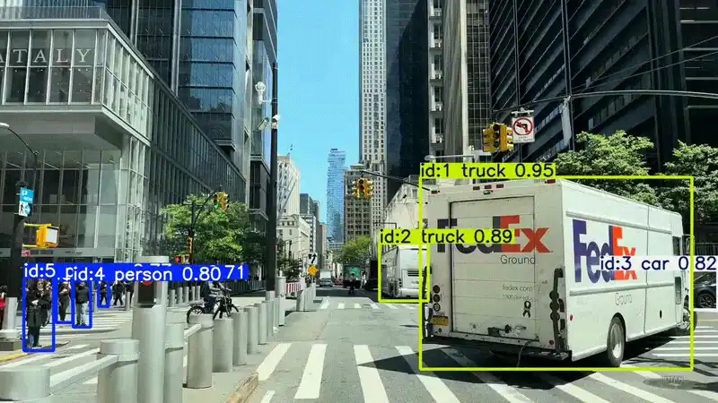
</a>

Video: [https://www.youtube.com/watch?v=_Wyg213IZDI](https://www.youtube.com/watch?v=_Wyg213IZDI).

## Selection procedure

### Segments of videos were not selected if frames are skipped
<a href="https://youtu.be/0K9vaQxKZ9k">
  
</a>

Video: [https://www.youtube.com/watch?v=0K9vaQxKZ9k](https://www.youtube.com/watch?v=0K9vaQxKZ9k).

### Snippets of videos are not analysed during the movement of camera
<a href="https://youtu.be/3jVszt_78_k">
  
</a>

Video: [https://www.youtube.com/watch?v=3jVszt_78_k](https://www.youtube.com/watch?v=3jVszt_78_k).

### Videos are excluded from analysis if the camera is unstable or shaking
<a href="https://youtu.be/uFG1_JBZUmM">
  
</a>

Video: [https://www.youtube.com/watch?v=uFG1_JBZUmM](https://www.youtube.com/watch?v=uFG1_JBZUmM).

### Snippets of videos captured in parking areas were excluded from analysis
<a href="https://youtu.be/U0pdQ8eZtHY">
  
</a>

Video: [https://www.youtube.com/watch?v=U0pdQ8eZtHY](https://www.youtube.com/watch?v=U0pdQ8eZtHY).

### Videos are excluded from analysis if another video is a part of main video
<a href="https://youtu.be/rdx7UFXYSz0">
  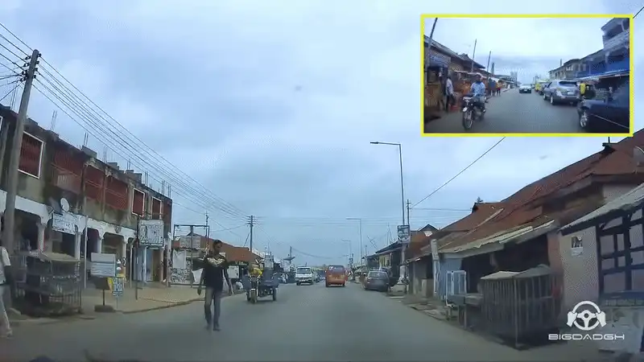
</a>

Video: [https://www.youtube.com/watch?v=rdx7UFXYSz0](https://www.youtube.com/watch?v=rdx7UFXYSz0).

## Verification of segments
After segments were added, they were checked again by hand. The checks were done by Md Shadab Alam, on the `main` branch, for the segments of `mapping.csv`, including the videos that other contributors of this repository added (see [Who added the videos](#who-added-the-videos)).

**1. Candidate cuts.** Points inside segments where the footage may break (a jump in time, a different clip, or a part that should not be analysed) are listed in `cut_times.csv`, with the video, the segment start and the time of the candidate cut.

**2. Reviewing.** For each candidate cut, the YouTube video was played for a few seconds around the cut. The reviewer marked the candidate as `yes` (a real cut), `no` (not a cut) or `unavailable` (YouTube no longer plays or embeds the video), and could add a note. The decision and the time of the review are saved in `cut_times.csv`.

In total, 52,838 cuts were analysed.

**3. What the reviewer looked for.**
- **Cuts in videos added by other contributors.** The segments of the videos added by the other authors of the repository were checked for cuts, in the same way as the others.
- **Videos that are not at normal speed.** Videos that play faster or slower than 1x (for example fast-forwarded footage or time-lapses) are not suitable, because speeds and crossing times in them are wrong. Such cases are noted, for example as `fast forward`.
- **Advertisements in the footage.** An advertisement that was cut into the middle of a video is not footage of the road. Where one was found, it was removed from the segments by the reviewer.

**4. Applying the result.** Each candidate marked `yes` splits its segment in `mapping.csv` into the part before and the part after the cut, and the detection CSV of the segment is split at the same time, so that the footage around the cut is not analysed. Segments that become too short are removed. Detection CSVs that no longer match a segment in `mapping.csv` are removed from the data folder.

## Description and analysis of dataset
> **Note:** The interactive figures are displayed using `htmlpreview.github.io`, which may be blocked on some institutional or education networks. If an interactive figure does not open, try another network or download the corresponding `.html` file from the `figures` directory and open it locally in a web browser.

### Description of dataset


[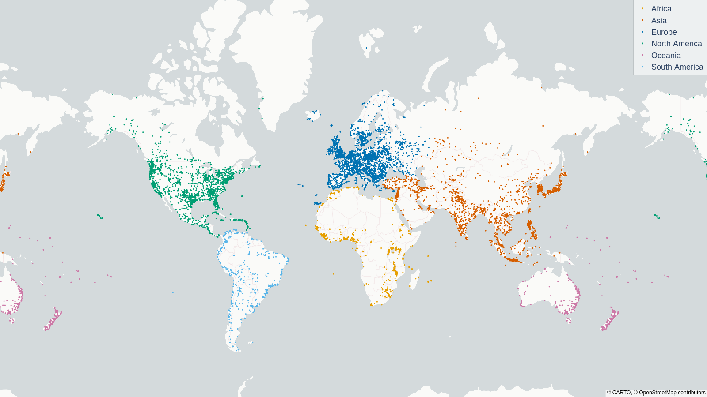](https://htmlpreview.github.io/?https://github.com/crowd-dataset/crowd/blob/main/figures/mapbox_map_all.html)
Locations of cities with footage in dataset. *Note:* continents are based on geography, i.e., the cities in Russia east from Ural mountains are shown as Asia.

[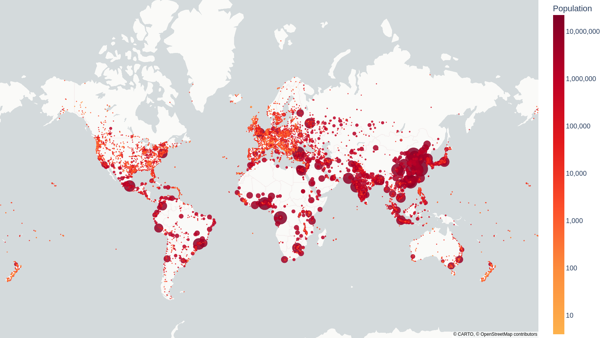](https://htmlpreview.github.io/?https://github.com/crowd-dataset/crowd/blob/main/figures/mapbox_map_all_pop.html)
Locations of cities with footage in dataset with a density overlay of population. *Note:* continents are based on geography, i.e., the cities in Russia east from Ural mountains are shown as Asia.

[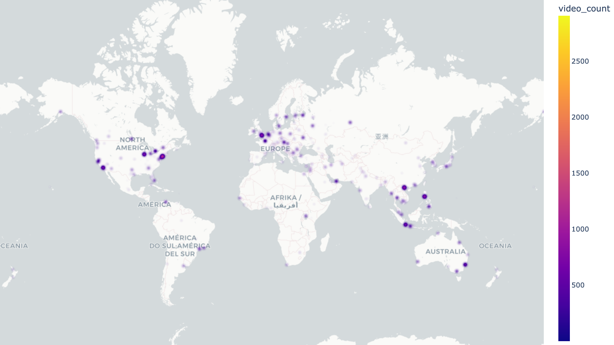](https://htmlpreview.github.io/?https://github.com/crowd-dataset/crowd/blob/main/figures/mapbox_map_all_videos.html)
Locations of cities with footage in dataset with a density overlay of the number of videos in the dataset. *Note:* continents are based on geography, i.e., the cities in Russia east from Ural mountains are shown as Asia.

[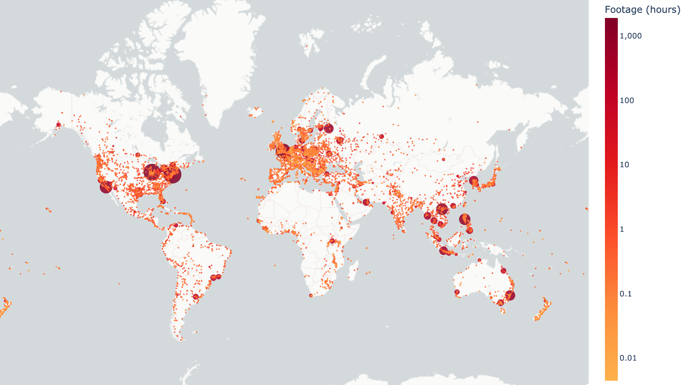](https://htmlpreview.github.io/?https://github.com/crowd-dataset/crowd/blob/main/figures/mapbox_map_all_time.html)
Locations of cities with footage in dataset with a density overlay of the total number of seconds of footage in the dataset. *Note:* continents are based on geography, i.e., the cities in Russia east from Ural mountains are shown as Asia.

[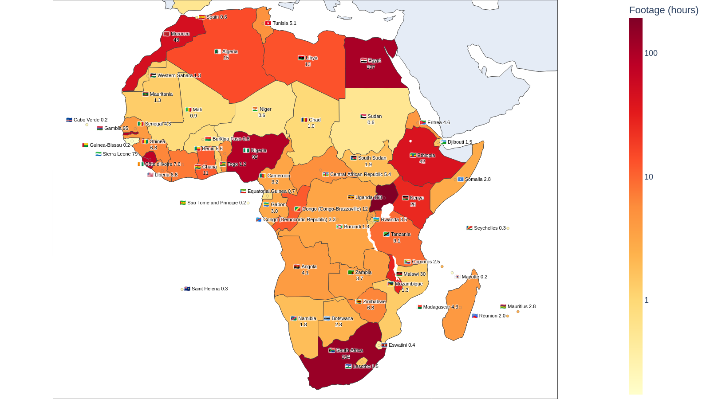](https://htmlpreview.github.io/?https://github.com/crowd-dataset/crowd/blob/main/figures/map_footage_africa.html)
Amount of footage (hours) per country in Africa. *Note:* the colour scale is logarithmic; countries are grouped by the continent of their cities in the dataset.

[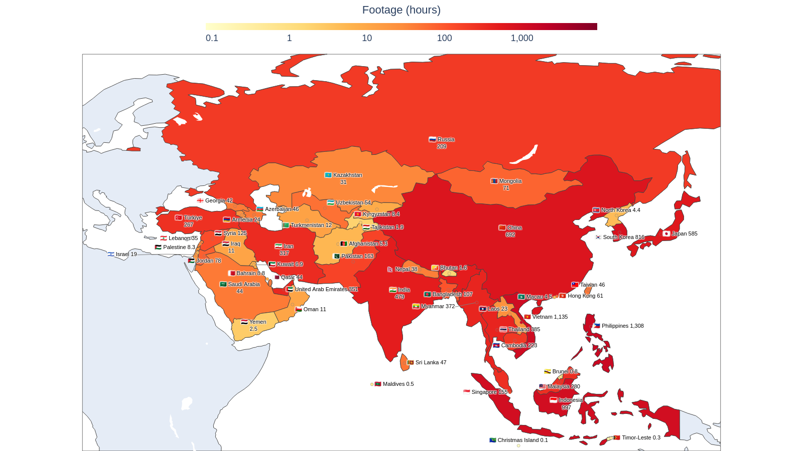](https://htmlpreview.github.io/?https://github.com/crowd-dataset/crowd/blob/main/figures/map_footage_asia.html)
Amount of footage (hours) per country in Asia. *Note:* the colour scale is logarithmic; countries are grouped by the continent of their cities in the dataset.

[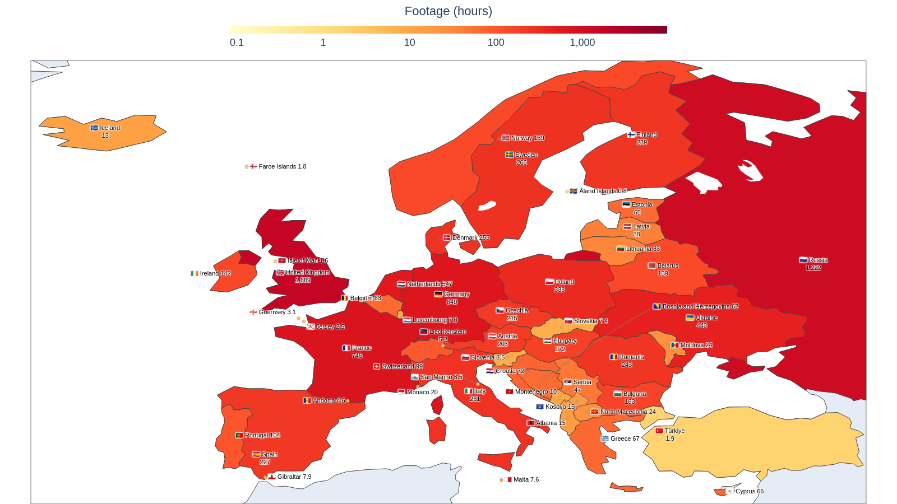](https://htmlpreview.github.io/?https://github.com/crowd-dataset/crowd/blob/main/figures/map_footage_europe.html)
Amount of footage (hours) per country in Europe. *Note:* the colour scale is logarithmic; countries are grouped by the continent of their cities in the dataset.

[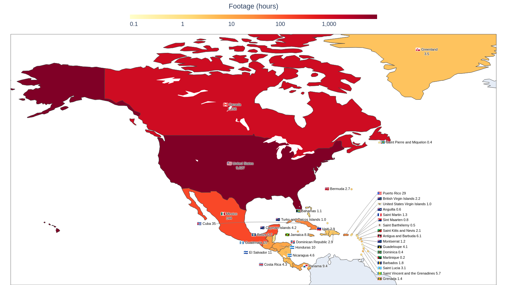](https://htmlpreview.github.io/?https://github.com/crowd-dataset/crowd/blob/main/figures/map_footage_north_america.html)
Amount of footage (hours) per country in North America. *Note:* the colour scale is logarithmic; countries are grouped by the continent of their cities in the dataset.

[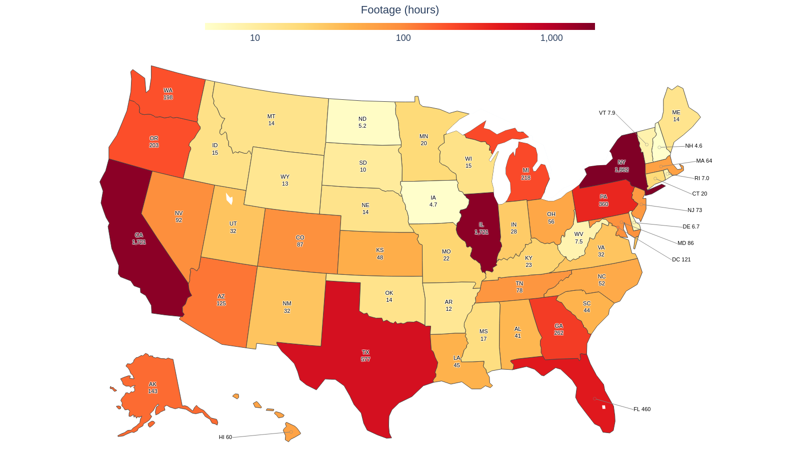](https://htmlpreview.github.io/?https://github.com/crowd-dataset/crowd/blob/main/figures/map_us_states_footage.html)
Amount of footage (hours) per US state. *Note:* the colour scale is logarithmic.

[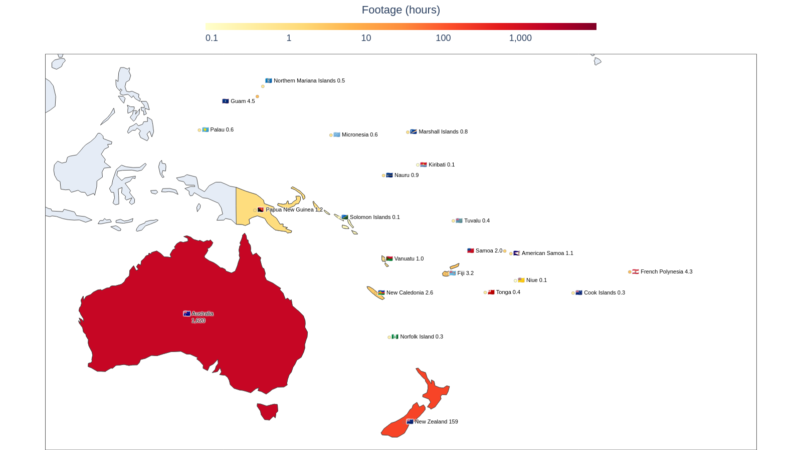](https://htmlpreview.github.io/?https://github.com/crowd-dataset/crowd/blob/main/figures/map_footage_oceania.html)
Amount of footage (hours) per country in Oceania. *Note:* the colour scale is logarithmic; countries are grouped by the continent of their cities in the dataset.

[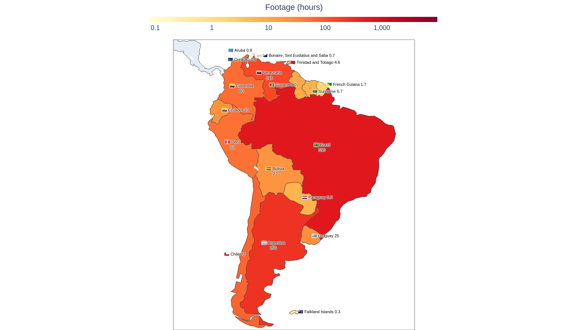](https://htmlpreview.github.io/?https://github.com/crowd-dataset/crowd/blob/main/figures/map_footage_south_america.html)
Amount of footage (hours) per country in South America. *Note:* the colour scale is logarithmic; countries are grouped by the continent of their cities in the dataset.

[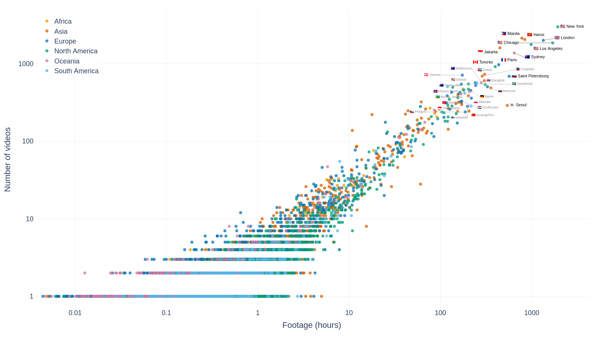](https://htmlpreview.github.io/?https://github.com/crowd-dataset/crowd/blob/main/figures/scatter_all_total_time-video_count.html)
Number of videos against the total amount of footage per locality (log scales). The 40 localities with the most footage are labelled, the top 12 in larger black text; in the HTML version, zoom in to label every point.

[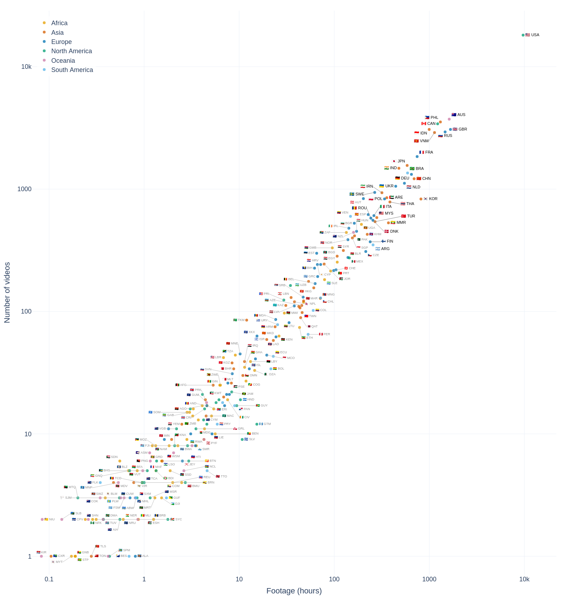](https://htmlpreview.github.io/?https://github.com/crowd-dataset/crowd/blob/main/figures/scatter_all_country_total_time-video_count.html)
Number of videos against the total amount of footage per country (log scales). Countries are labelled with their flag and ISO3 code, the 30 with the most footage in larger black text; in the HTML version, zoom in to label every point.

[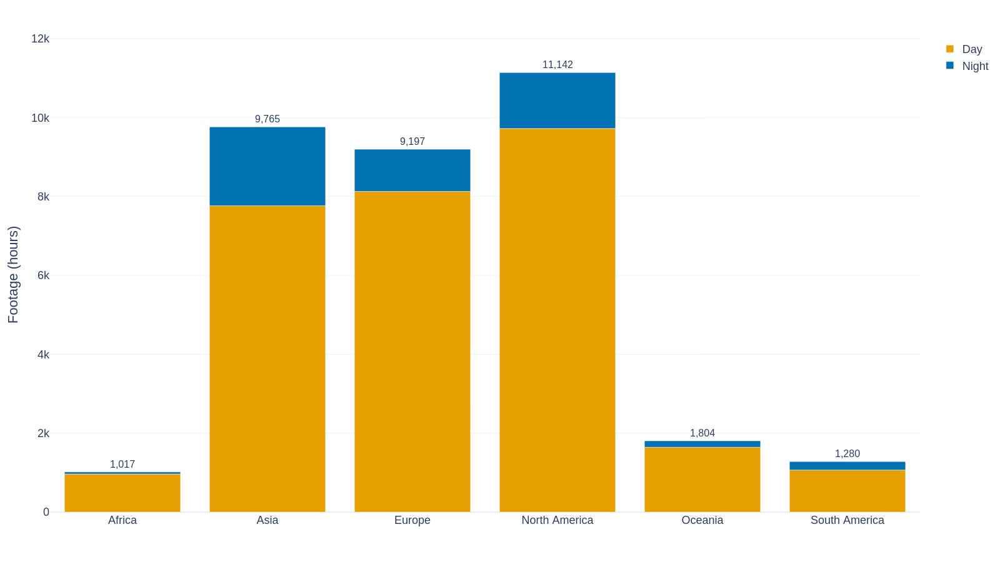](https://htmlpreview.github.io/?https://github.com/crowd-dataset/crowd/blob/main/figures/bar_continent_time_of_day.html)
Distribution of videos by continent. *Note:* continents are based on geography, i.e., the cities in Russia east from Ural mountains are shown as Asia.

[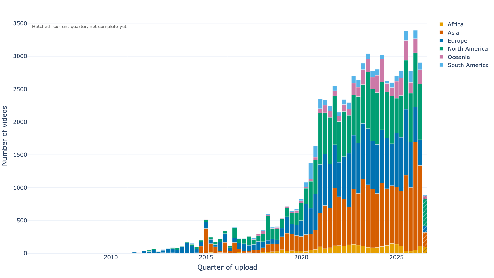](https://htmlpreview.github.io/?https://github.com/crowd-dataset/crowd/blob/main/figures/hist_months.html)
Number of videos by quarter of upload and continent. The current quarter (hatched) is not complete yet.

[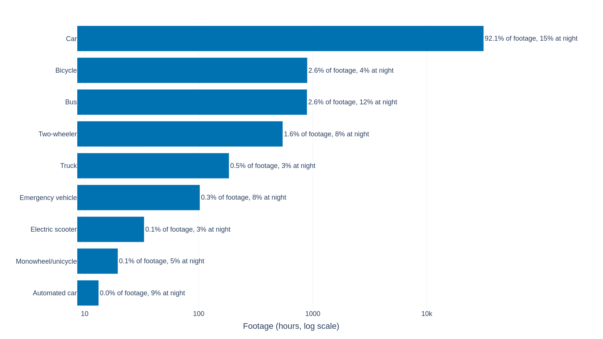](https://htmlpreview.github.io/?https://github.com/crowd-dataset/crowd/blob/main/figures/bar_vehicle_type_time_of_day.html)
Distribution of segments (parts of videos included in dataset) by type of vehicle.

[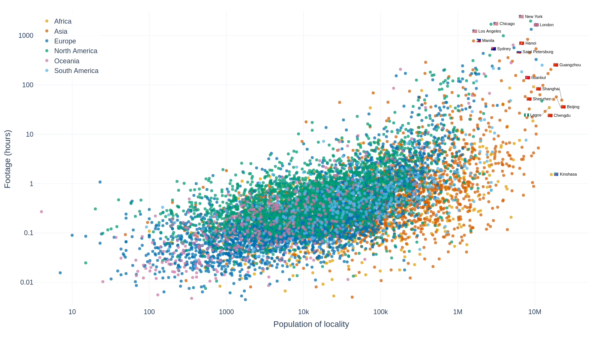](https://htmlpreview.github.io/?https://github.com/crowd-dataset/crowd/blob/main/figures/scatter_population_footage.html)
Amount of footage per locality against its population. Large localities with little footage are candidates for adding videos.

[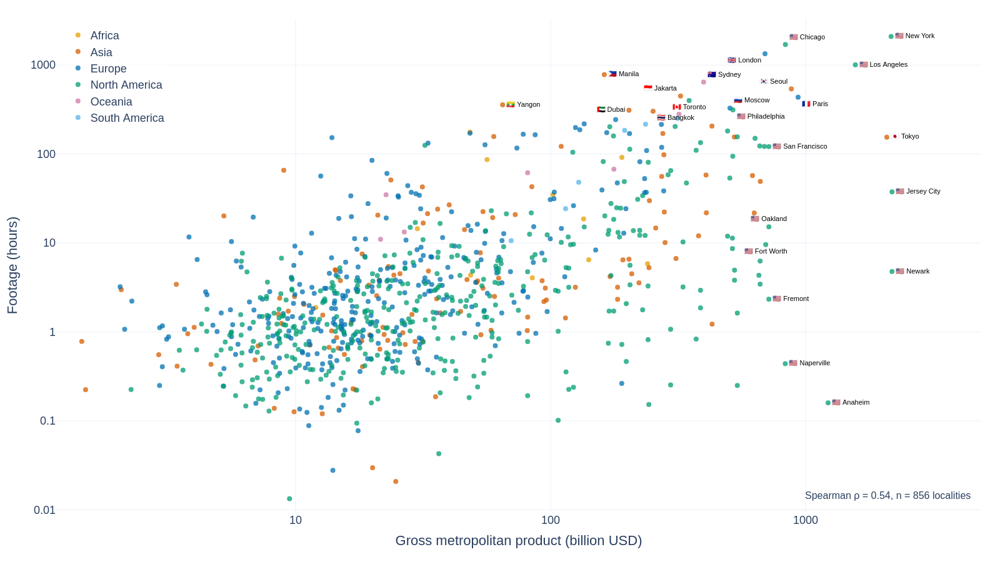](https://htmlpreview.github.io/?https://github.com/crowd-dataset/crowd/blob/main/figures/scatter_gmp_footage.html)
Amount of footage per locality against its gross metropolitan product (GMP, known for about 200 large cities), with the Spearman rank correlation: whether economically large cities dominate the data.

[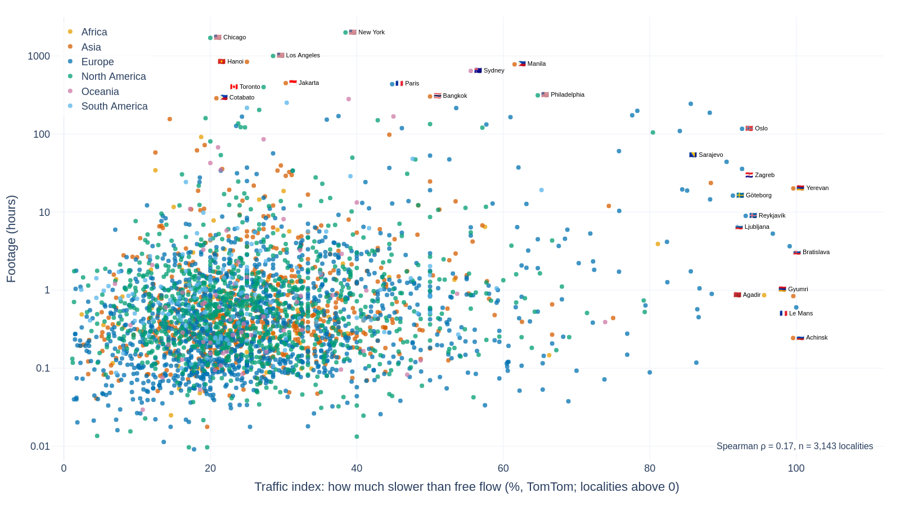](https://htmlpreview.github.io/?https://github.com/crowd-dataset/crowd/blob/main/figures/scatter_traffic_index_footage.html)
Amount of footage per locality against its traffic index (how much slower than free flow traffic is, from one TomTom reading per locality), for localities with a reading above 0, with the Spearman rank correlation.

[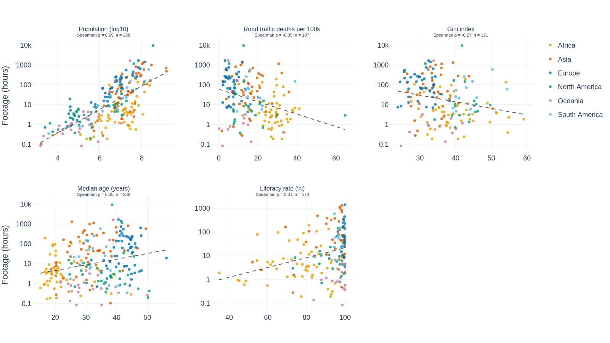](https://htmlpreview.github.io/?https://github.com/crowd-dataset/crowd/blob/main/figures/scatter_indicators_footage.html)
Amount of footage per country against country indicators, with the Spearman rank correlation and a trend line per panel, showing whether some kinds of countries are over- or under-represented.

[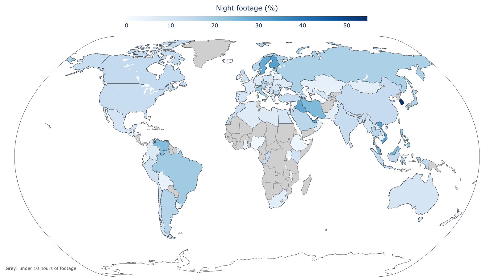](https://htmlpreview.github.io/?https://github.com/crowd-dataset/crowd/blob/main/figures/map_night_share.html)
Share of footage recorded at night per country. Countries with less than 10 hours of footage are grey, as their share is not reliable.

[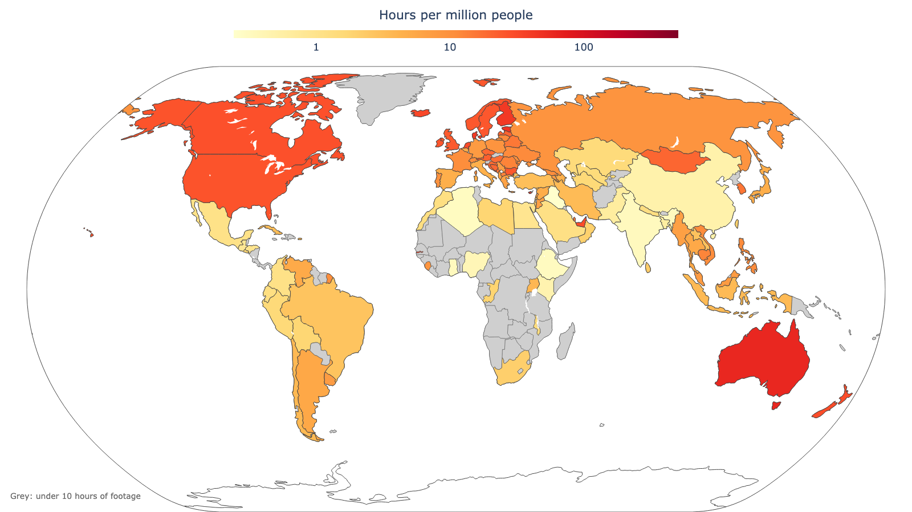](https://htmlpreview.github.io/?https://github.com/crowd-dataset/crowd/blob/main/figures/map_footage_per_capita.html)
Hours of footage per million inhabitants per country: coverage relative to country size (log scale).

[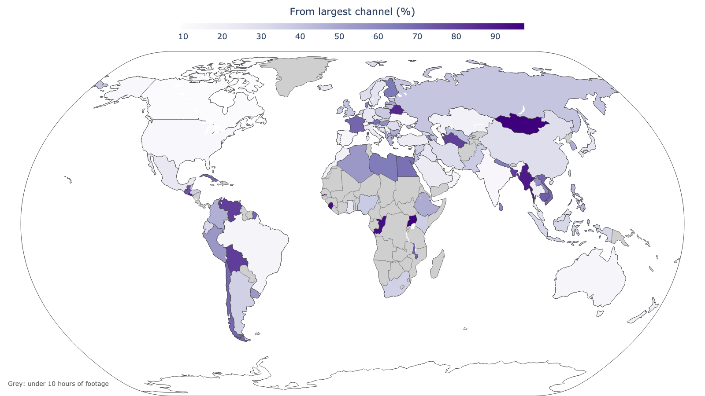](https://htmlpreview.github.io/?https://github.com/crowd-dataset/crowd/blob/main/figures/map_top_channel_share.html)
Share of each country's footage that comes from its largest YouTube channel. Where it is high, one uploader's routes and camera dominate that country's data. Countries with less than 10 hours of footage are grey.

[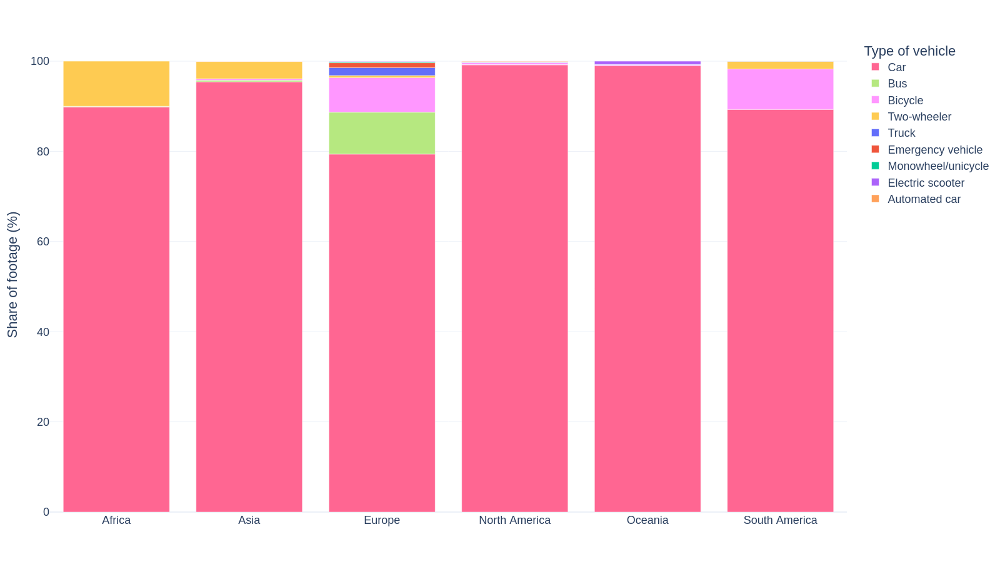](https://htmlpreview.github.io/?https://github.com/crowd-dataset/crowd/blob/main/figures/bar_vehicle_type_continent.html)
Type of vehicle the footage is recorded from, as a share of footage per continent.

[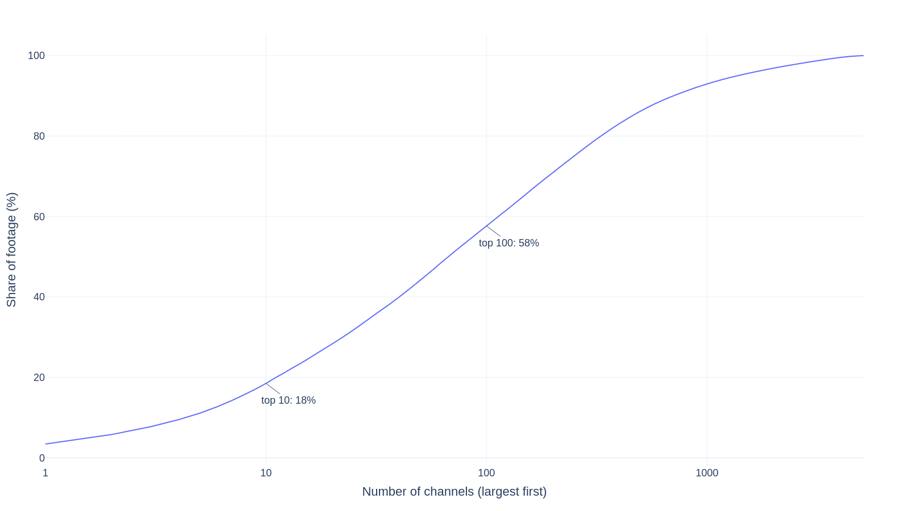](https://htmlpreview.github.io/?https://github.com/crowd-dataset/crowd/blob/main/figures/line_channel_concentration.html)
Share of footage coming from the largest YouTube channels.

[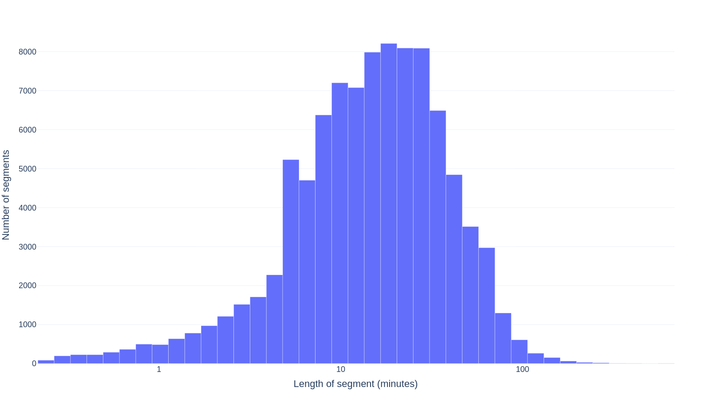](https://htmlpreview.github.io/?https://github.com/crowd-dataset/crowd/blob/main/figures/hist_segment_length.html)
Distribution of the length of segments (parts of videos included in the dataset).

[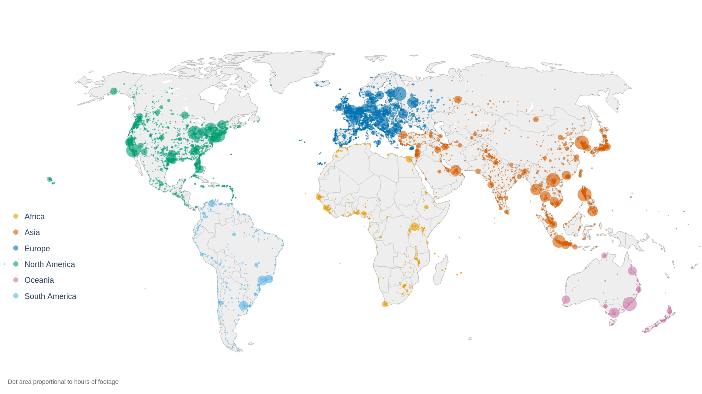](https://htmlpreview.github.io/?https://github.com/crowd-dataset/crowd/blob/main/figures/map_localities_footage.html)
Every locality in the dataset as a dot coloured by continent; the dot area is proportional to the hours of footage.

[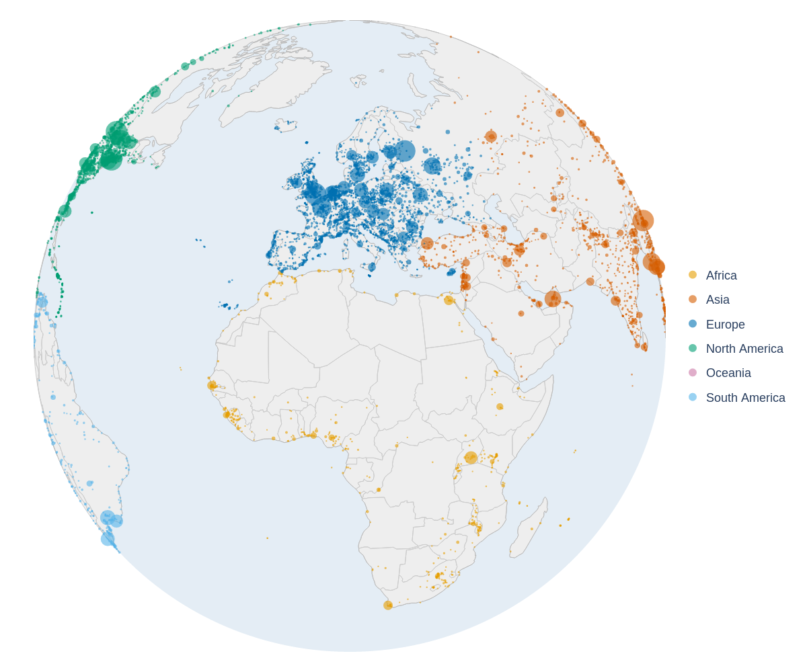](https://htmlpreview.github.io/?https://github.com/crowd-dataset/crowd/blob/main/figures/globe_localities_footage.html)
The same localities on a globe. The HTML version spins until you grab it; drag to turn it.

[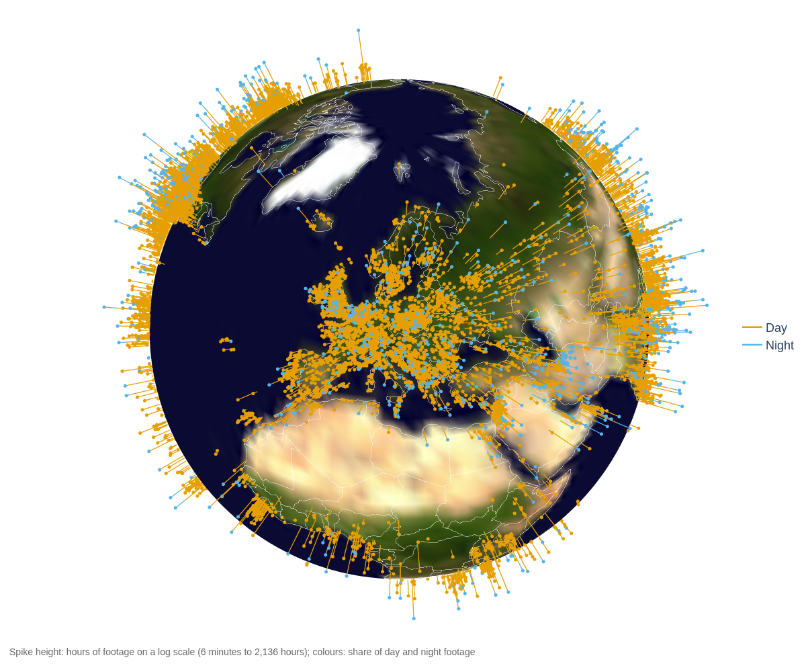](https://htmlpreview.github.io/?https://github.com/crowd-dataset/crowd/blob/main/figures/globe_localities_footage_spikes.html)
The localities on a 3D satellite globe (NASA Blue Marble), each with a spike whose height shows its hours of footage on a log scale, so localities with little footage are visible too. Each spike is orange for the share of its footage recorded by day and blue for the share at night. The HTML version spins until you grab it; drag to turn it, scroll to zoom.

[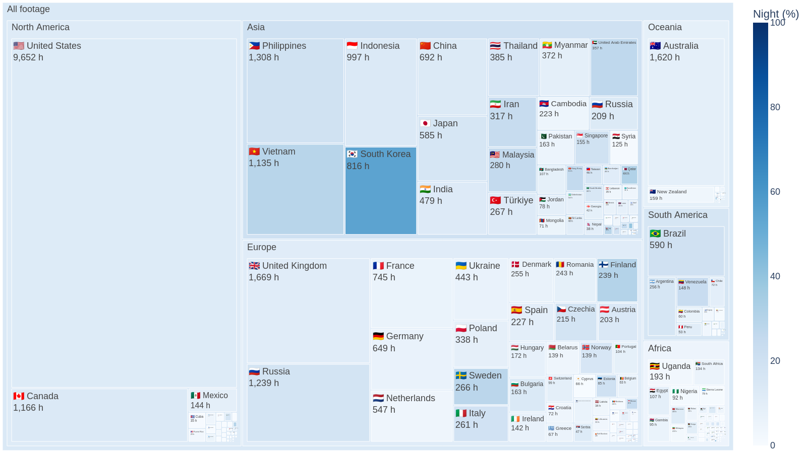](https://htmlpreview.github.io/?https://github.com/crowd-dataset/crowd/blob/main/figures/treemap_footage.html)
Footage by continent, country and locality, coloured by the share recorded at night. In the HTML version, click a box to zoom in down to the localities.

[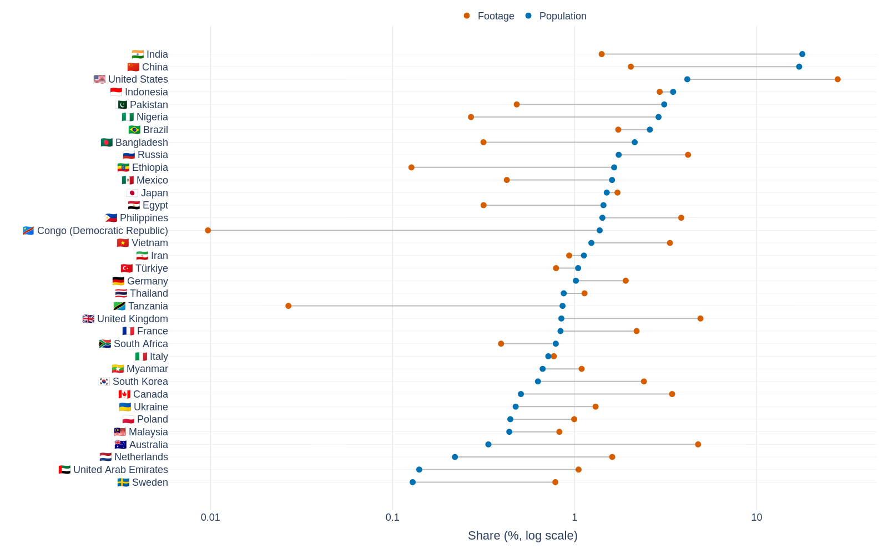](https://htmlpreview.github.io/?https://github.com/crowd-dataset/crowd/blob/main/figures/dumbbell_footage_population_share.html)
Share of footage against share of population (of all countries in the dataset) for the 25 largest countries by either share (log scale). Where the orange dot is left of the blue one, the country is under-represented.

[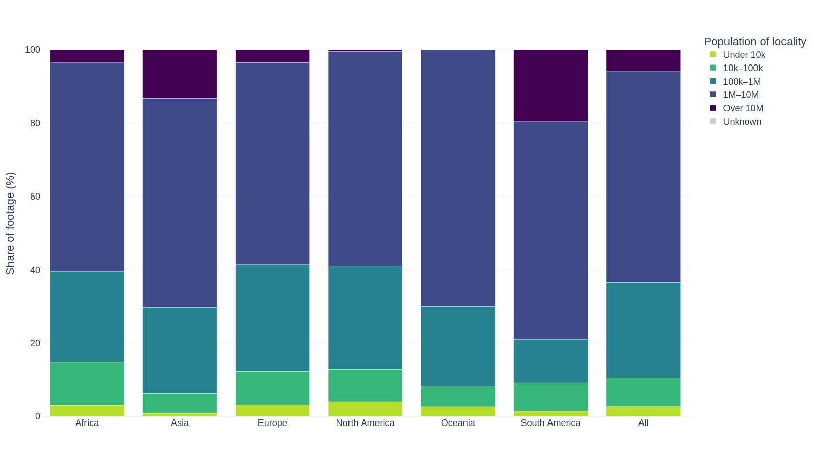](https://htmlpreview.github.io/?https://github.com/crowd-dataset/crowd/blob/main/figures/bar_footage_population_band.html)
Share of footage by population of the locality, per continent and overall: what "urban" means in each part of the dataset.

[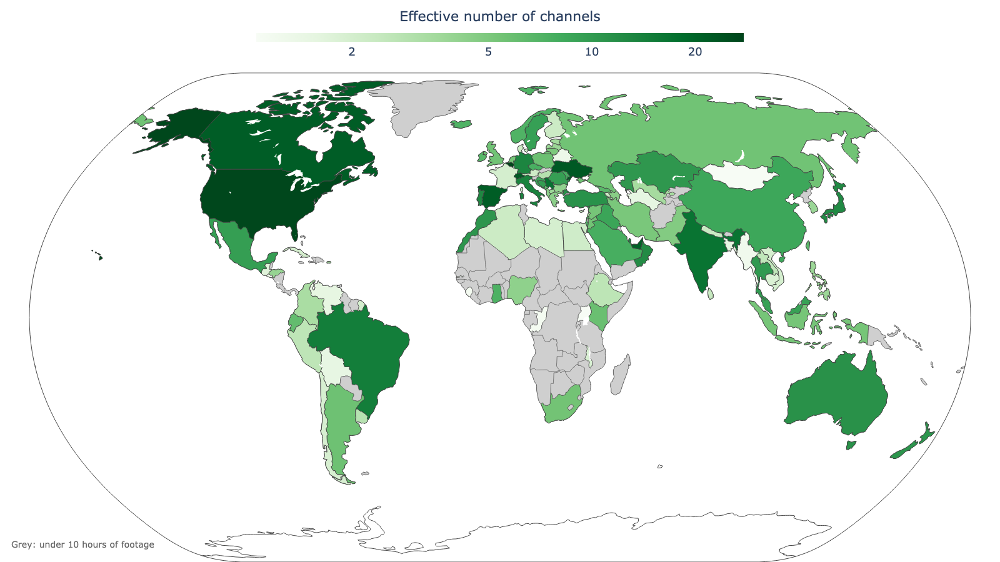](https://htmlpreview.github.io/?https://github.com/crowd-dataset/crowd/blob/main/figures/map_effective_channels.html)
Effective number of YouTube channels per country (inverse Herfindahl index of the channels' shares of footage): 1 means a single uploader; n means as diverse as n channels with equal shares. Countries with less than 10 hours of footage are grey.

[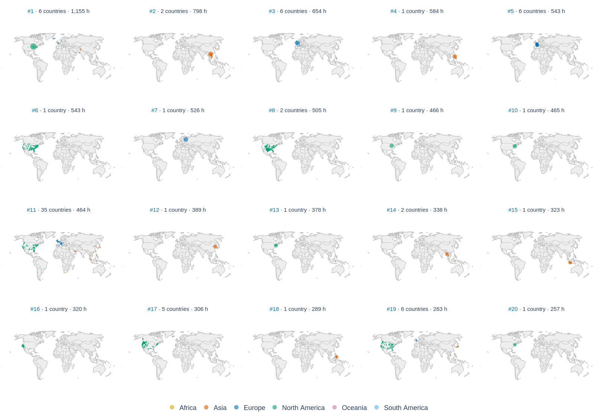](https://htmlpreview.github.io/?https://github.com/crowd-dataset/crowd/blob/main/figures/map_channel_footprints.html)
Where the 20 YouTube channels with the most footage film, numbered by footage, with the number of countries and hours of each (dot area proportional to hours). Travel channels span many countries; most large channels film in one country or city. In the HTML version, each channel's number links to the channel on YouTube.

[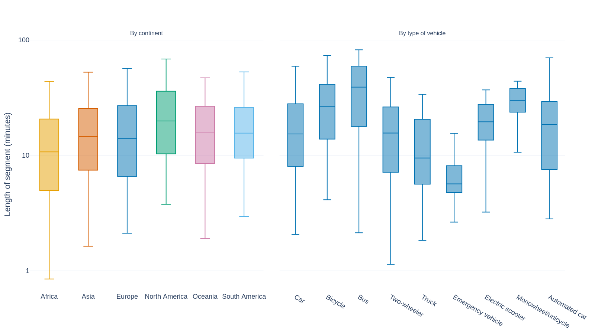](https://htmlpreview.github.io/?https://github.com/crowd-dataset/crowd/blob/main/figures/box_segment_length.html)
Length of segments by continent and by type of vehicle (boxes: quartiles; whiskers: 5th and 95th percentiles).

## Detections in the footage (YOLO)
Objects detected in the footage by YOLO (`yolo11x` with tracking): unique tracked persons, cars, bicycles, motorcycles, buses and trucks, counted with a confidence of at least 0.7 and expressed per minute of analysed footage. The tables and figures below are generated by `analysis.py` when it runs with access to the YOLO detection CSV files (the `data` folders in `config`); elsewhere, for example in the GitHub Action, this section is left as it is.

The detections are automatic outputs, not ground truth. What the detector sees depends on the camera, resolution and viewpoint, so the figures by vehicle type and by year of upload show these effects next to the comparisons between countries.

<!-- yolo-figures:start -->
*Not generated yet: run `python analysis.py` on a machine with the YOLO detection CSV files.*
<!-- yolo-figures:end -->


## Adding videos to dataset
To add videos to the `mapping` file by hand, run `python add_video.py`. It opens a web form (a Flask app on a local port) for one video at a time. Fill in the locality, the state (optional, recommended for the USA 🇺🇸 and Canada 🇨🇦), the country (mandatory, chosen from a list) and the YouTube link, and click **Fetch data**. While you type the locality, the form suggests localities that are already in the mapping file.

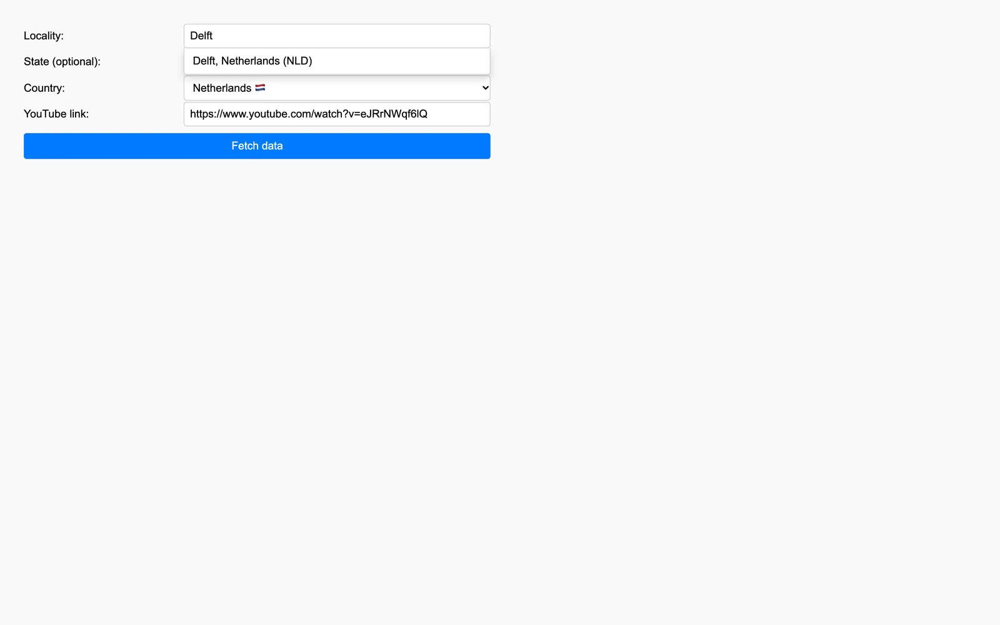
Adding a video to Delft, Netherlands 🇳🇱 (with no state), before fetching its data. While the locality is typed, the form suggests the matching locality already in the mapping file.

**Fetch data** checks whether the locality is already in the mapping file and looks up the rest. For the video: its upload date and channel from YouTube. For a new locality: its coordinates, population and gross metropolitan product (GDP), the country's population, road deaths, continent, literacy rate, average height, median age and Gini index, and the traffic index (see [The `secret` file](#the-secret-file) for the services used). The video plays next to the form, with the current second of the player, the last second of the video and a map of the locality.

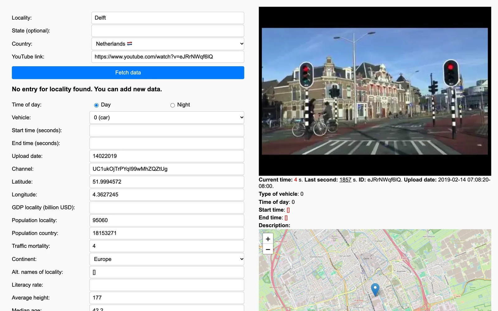
The same video after fetching its data, from before Delft was in the mapping file: with no entry for Delft yet, the form adds it as a new locality. Its coordinates are shown on the map under the video; dragging the marker adjusts them.

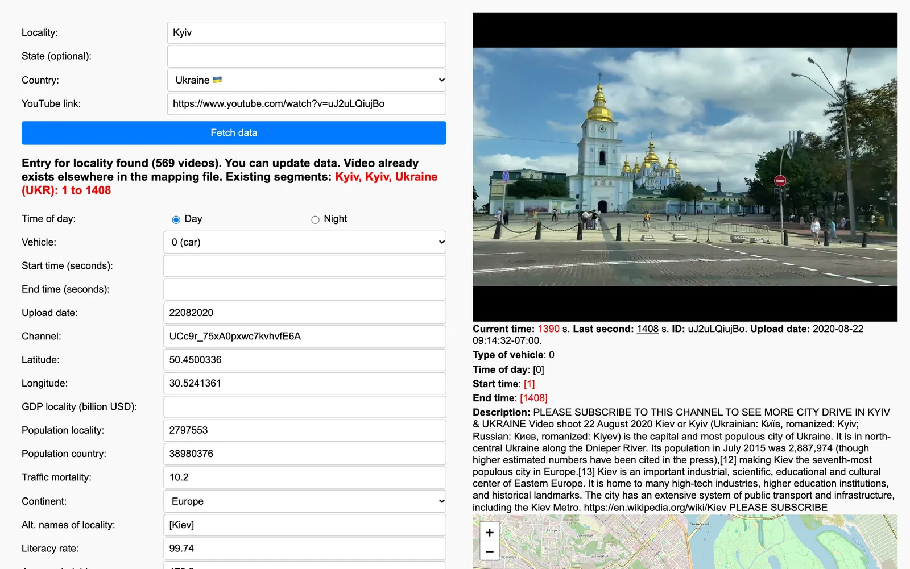
Kyiv, Ukraine 💙💛 is in the mapping file (with 569 videos), so the form adds the video to it. This video is in the mapping file already: the form shows its existing segments in red (here from second 1 to 1408) next to the player, so a new segment is added after them or the existing ones can be checked.

For each segment (part of a video), add the `Time of day` (day or night), the `Vehicle` the footage is filmed from, the `Start time (seconds)` and the `End time (seconds)` (larger than the start), and click **Submit**. A video can have several segments, each starting at or after the end of the previous one; the values of the video (upload date, channel) and of the locality are kept, so for each further segment only its start, end, time of day and vehicle need to be filled in. All values can be corrected in the form before submitting, and by hand in the `mapping` file later.

## Shortcuts and click events
The form accepts the following shortcuts (when the cursor is not in a text field; they also work with non-Latin keyboard layouts):
1. **A**: the current second of the video into "Start time (seconds)".
2. **S**: the current second of the video into "End time (seconds)".
3. **D**: the whole video: "Start time (seconds)" 0 and "End time (seconds)" the last second of the video. Clicking on "Last second" under the video does the same (and copies it).
4. **Q**: "Day" for "Time of day".
5. **W**: "Night" for "Time of day".

## Proposing segments from YouTube channels
Instead of finding segments by hand in `add_video.py`, whole YouTube channels can be processed automatically: `propose_segments.py` downloads each video of a channel at low resolution, proposes segments, localities, time of day and vehicle type, and a curator reviews the proposals on a web page and applies the approved ones to the `mapping` file. Nothing is written to the mapping before a curator applies it.

**1. Channels to process.** `run_channels.py` takes channels from a Google Sheet (the sheet URL is set in `run_channels.py`): column A is the channel URL, column B its status and column C its country. It works from the bottom of the sheet up, through channels with an empty status, and proposes segments for each in chunks of videos (`--chunk`, default 15), each chunk in a new process, so changes to the code apply from the next chunk:

```bash
python run_channels.py
```

It runs until stopped (`--max-minutes N` stops after N minutes) and continues where it stopped when restarted. It cannot write to the sheet: it logs lines starting with `SHEET:` (set row N to Processing, Processed or Rejected) for the curator to copy into the sheet. Without a country in column C, it uses the channel's country on YouTube. A single channel can also be processed directly:

```bash
python propose_segments.py --channel https://www.youtube.com/@CHANNEL --country "Netherlands" --limit 20
```

The country must be written as in the `add_video.py` form. `--single-city` treats all of a channel's videos as one city (no drives from A to B), and `--no-download` proposes whole videos from YouTube metadata only. Downloading needs `yt-dlp`, `ffmpeg` and `node`; when YouTube asks to sign in, put a `cookies.txt` exported from your browser in the root of the project. The `youtube_api_key` in the `secret` file is needed to list channels (see [The `secret` file](#the-secret-file)).

**2. What is proposed automatically.** Videos are left out from their metadata when they are shorter than 5 minutes, live, portrait, or walking tours, time-lapses, compilations, crash videos, highway drives or road trips. For the others, a 160x90 copy is analysed at 2 frames per second:
- *segments:* stationary stretches at the start and end are trimmed and stops longer than 3 minutes are cut out; hard cuts (edits), blank frames and title cards end a segment; footage with the camera facing the driver, not facing forward or shaking, and rural or highway stretches (from YOLO detections) are left out; segments shorter than 30 seconds are dropped. Whole videos are left out for picture-in-picture or skipped footage, and a channel where ten videos in a row have skips is rejected;
- *time of day:* night when the sky or the street is dark for at least a minute, with a hint at dusk;
- *vehicle:* the most common vehicle type of the channel's videos already in the mapping (a car, with a note, for a new channel);
- *locality:* from the title, then the description, then the chapters (a video with chapters for several places is split), and otherwise a named place looked up on OpenStreetMap; drives "from A to B" are split into the towns along the route; a town within 30 km of a city with over a million people counts as that city unless it has 250,000 people itself;
- *re-uploads* of a video already in the mapping are recognised and left out.

The proposals of a channel are kept in `_output/proposals/<channel>/plan.json`, with frames and signals of each video. Videos left out are listed on the review page with the reason:


Videos of the same channel as the Kyiv example of `add_video.py`, left out automatically: a video under 5 minutes, a walk, and a drive that skips footage (an edit cut).

**3. Reviewing.** Run `python review_hub.py` and open [http://127.0.0.1:8770](http://127.0.0.1:8770): it lists the channels with videos to review, and clicking one opens its review page (also available directly with `python propose_segments.py --review _output/proposals/<channel>/plan.json`).

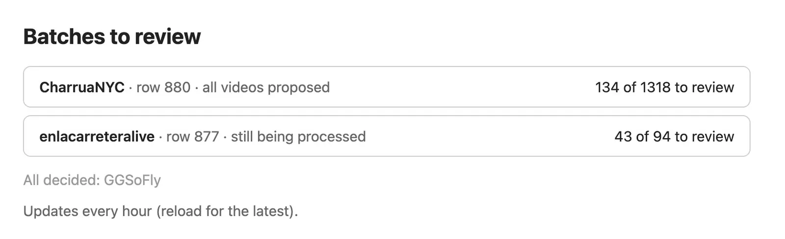
The review hub: channels with videos still to decide.
 For each video, the page shows the player, the title and description, a contact sheet of frames, a route map, and the proposed segments with the reasons for each cut. Per segment, the curator can change the start and end, switch day and night, approve, reject, split it at a time, move it to another locality, or add a new segment; per video, change the vehicle, locality, state and country (with a map for a new locality), approve the rest of the video or reject it. Shortcuts: **A** sets the start and **S** the end of a segment to the current time of the player, **D** takes the whole video, **Q** and **W** set day and night, and **F** puts the current time in the split box.

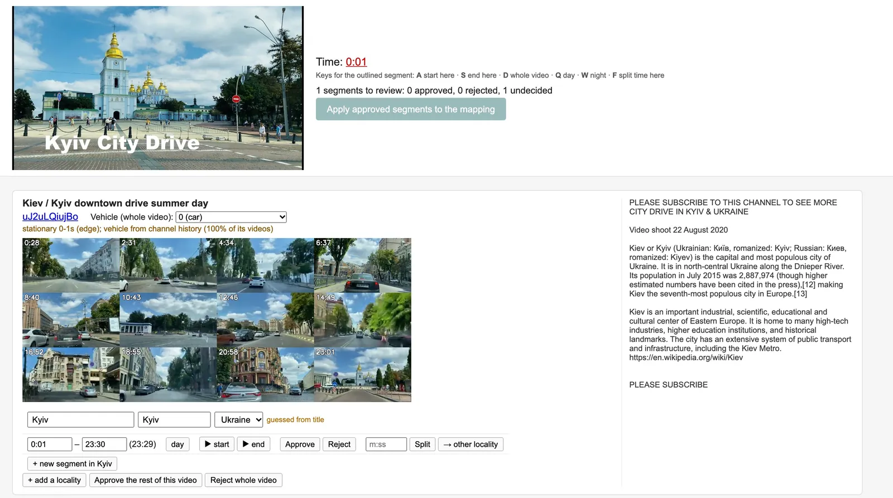
The proposal for the Kyiv video used in the `add_video.py` example above: one segment from 0:01 to 23:30 in Kyiv, Ukraine (the locality guessed from the title, the vehicle from the channel's other videos in the mapping), with a contact sheet of frames and the video's description; it matches the segment added by hand (seconds 1 to 1408).

**4. Applying.** **Apply** adds the approved segments to the `mapping` file through the same code as the `add_video.py` form: the video, its segments, time of day, vehicle type, upload date and channel, and for a new locality a new row with its coordinates, population and other values. Applied segments are marked in `plan.json` and cannot be changed on the page any more. Overlapping segments are refused, and writes to the mapping file are locked, so several review pages and a running channel batch can be used at once. Do not stop a review page while it is applying.

**5. Merging towns into cities.** `python review_merges.py` serves a page at [http://127.0.0.1:8772](http://127.0.0.1:8772) with towns of under 250,000 people within 30 km of a city of over a million in the same state, side by side on maps: **Y** merges a town into the city, **N** keeps it separate. `python review_merges.py --apply` merges the accepted towns: their videos move to the city and their name is added to the city's other names.

## Who added the videos
Videos are added by several people, each in their own copy of the mapping file: `mapping.csv` is Pavlo's, `mapping-olena.csv` Olena's, `mapping-shadab.csv` and `mapping-epfl.csv` Shadab's and, in general, `mapping-NAME.csv` NAME's. Videos added to `mapping.csv` in commits from a contributor's own account (currently Shadab's and Faye's) are credited to that contributor. Each video is credited to the file it first appeared in (`video_contributors.csv`, built from the git history with `python -m utils.analytics.contributors` and extended by `analysis.py` with new videos). A video that appeared in `mapping.csv` and another file at the same time is credited to `mapping.csv`, as the other files are refreshed with copies of it. The table counts the videos in the dataset now.

<!-- contributors:start -->
<!-- Generated by analysis.py, do not edit by hand. -->
| # | Contributor | Videos | Footage (h) | Localities | Countries | First added | Last added |
|---|---|---|---|---|---|---|---|
| 1 | Pavlo | 68,825 | 31,009.2 | 7,375 | 232 | 2025-01-19 | 2026-10-08 |
| 2 | Olena | 4,543 | 1,691.4 | 933 | 90 | 2025-05-03 | 2026-10-08 |
| 3 | Shadab | 2,818 | 1,447.9 | 499 | 96 | 2023-12-17 | 2026-07-22 |
| 4 | Margarida | 54 | 25.0 | 34 | 4 | 2025-05-02 | 2025-06-05 |
| 5 | Aloysia | 38 | 18.3 | 17 | 2 | 2025-04-29 | 2025-07-08 |
| 6 | Faye | 42 | 14.8 | 29 | 11 | 2026-06-30 | 2026-07-12 |

[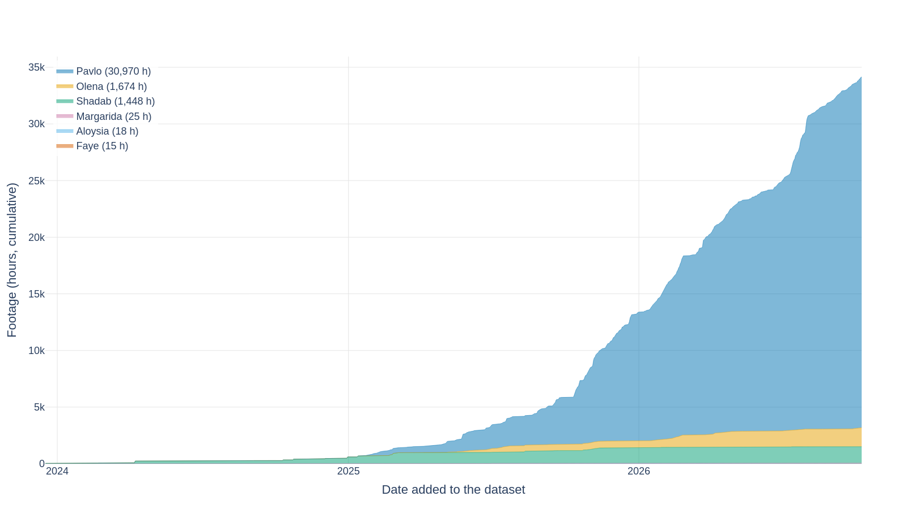](https://htmlpreview.github.io/?https://github.com/crowd-dataset/crowd/blob/main/figures/area_contributors_footage.html)
Footage in the dataset over time, by who added it (cumulative hours of the videos in the dataset now, by the date they were added).
<!-- contributors:end -->

## Contact
If you have any questions or suggestions, feel free to reach out to md_shadab_alam@outlook.com or pavlo.bazilinskyy@gmail.com.

## Licence

**Code:** MIT License  
**CROWD dataset:** Creative Commons Attribution 4.0 International (CC BY 4.0)

The dataset licence covers CROWD generated structured data, annotations,
and derived computer vision outputs. It does not cover the underlying
YouTube videos or other third party content.

CROWD does not redistribute the original YouTube videos, extracted frames,
or images. Source videos remain subject to the rights of their respective
owners and YouTube's Terms of Service.
